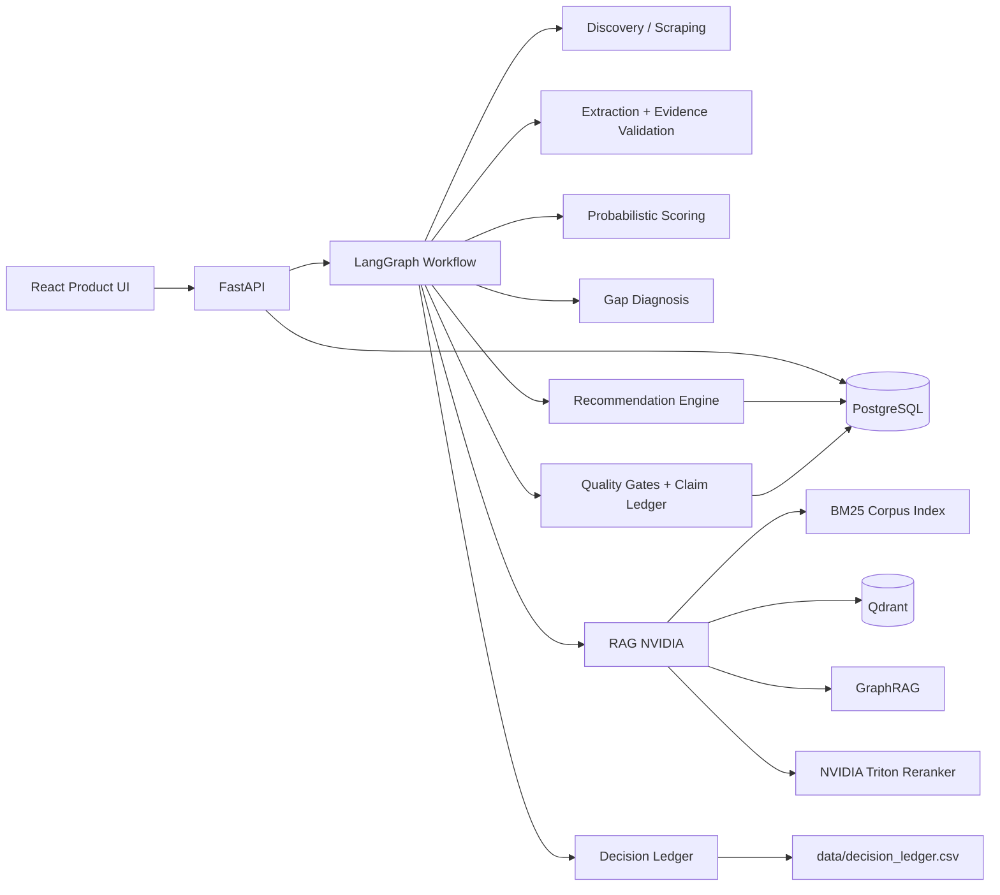

# NVIDIA Startup AI Radar

Sistema técnico para descoberta, avaliação e ranqueamento de startups brasileiras AI-native com recomendação auditável de tecnologias NVIDIA.

O projeto não é um chatbot nem um demo isolado. Ele é uma aplicação de inteligência de mercado com runtime único: uma API FastAPI persiste startups, candidatos, evidências, execuções de análise, resultados do workflow, recomendações, dossiers, exports, quality gates e ranking final de oportunidades. O fluxo principal é orquestrado por LangGraph e combina scraping governado, extração estruturada, validação de evidência, scoring probabilístico, diagnóstico de gaps, RAG NVIDIA obrigatório e ranking por utilidade esperada.

## Contrato de produto

O produto deve entregar uma lista ranqueada de oportunidades, não exigir que o usuário escolha manualmente uma única startup como caso fixo. A operação esperada é:

1. Descobrir ou importar várias startups/candidatas.
2. Promover candidatas relevantes para `Startup`.
3. Executar o workflow de análise para cada startup/candidata.
4. Calcular `opportunity_score` para cada `analysis_run`.
5. Expor o ranking global em `GET /opportunities/ranked`.

A UI deve consumir o ranking global para mostrar todas as startups analisadas com seus scores, tiers, justificativas e próxima ação. Telas de detalhe existem para auditoria individual, mas o output de decisão do produto é uma lista ordenada.

## Stack técnica

| Camada | Implementação |
|---|---|
| Backend API | FastAPI em `src/api/main.py` |
| Orquestração | LangGraph `StateGraph` em `src/orchestration/graph.py` |
| Estado de workflow | `ProductWorkflowState` em `src/orchestration/state.py` |
| Persistência transacional | SQLAlchemy + PostgreSQL em `src/database/models.py` |
| Checkpoint de workflow | LangGraph PostgresSaver em modo produto |
| Descoberta | `StartupDiscoveryService` + source registry + scrapers por diretório |
| Scraping | Collectors governados, rate limit, cache, robots/terms e deduplicação |
| Extração | Schemas Pydantic + extração estruturada de perfil/evidências |
| Classificação | AI-native classifier + scores de fit, maturidade e readiness |
| RAG NVIDIA | BM25 + Qdrant dense retrieval + GraphRAG + NVIDIA Triton reranker |
| Recomendação | Gap-to-technology mapping + expected utility ranker |
| Qualidade | Quality gates, claim ledger, product quality runs e readiness checks |
| Frontend | React 19 + TypeScript + Vite em `frontend/` |
| Observabilidade | `/metrics` Prometheus quando `prometheus_client` está instalado |

### Como cada tecnologia entra no runtime

A documentação agora separa **stack** de **uso técnico real**. O resumo abaixo mostra o papel de cada bloco; a explicação completa está em `docs/TECNOLOGIAS_E_TECNICAS.md`.

| Bloco | Como participa da decisão final |
|---|---|
| FastAPI + Pydantic | Recebe requests, valida contratos e entrega respostas tipadas para UI e automações. |
| SQLAlchemy + PostgreSQL + Alembic | Persistem startups, evidências, analysis runs, workflow runs, claims, quality runs e opportunity scores. |
| LangGraph + PostgresSaver | Executa a pipeline única de produção com estado compartilhado, checkpoint, retry e human-in-the-loop. |
| Discovery + scraping governado | Descobre startups/candidatas, coleta evidências públicas, deduplica e aplica gates mínimos de cobertura. |
| Extração + classificação AI-native | Converte texto em perfil estruturado, sinais técnicos, evidências e classe AI-native com confiança/incerteza. |
| Gap diagnosis | Detecta gaps técnicos que justificam uma recomendação NVIDIA. |
| BM25 + Qdrant + GraphRAG + Triton | Recupera e reranqueia contexto técnico NVIDIA por gap, com suporte lexical, semântico, relacional e neural. |
| Technique runner | Aplica técnicas adicionais de retrieval, reranking, post-processing e reflection definidas em `config/techniques.yaml`. |
| Expected utility + opportunity score | Ranqueia recomendações e startups por valor esperado, evidência, risco, complexidade, qualidade e readiness. |
| Claim ledger + quality gates | Garante que claims, dossiers e recomendações tenham suporte auditável antes da entrega final. |

## Arquitetura em alto nível



## Pipeline única de produção

A entrada principal é:

```text
POST /workflows/product-runs
```

Ordem do grafo:

```text
preflight_configuration_check
→ load_startup_or_candidate
→ plan_search
→ collect_sources
→ extract_profile
→ validate_evidence
→ score_startup_probabilistic
→ diagnose_gaps
→ retrieve_nvidia_context
→ enhance_contexts_with_techniques
→ map_nvidia_technologies
→ rank_recommendations
→ rank_with_expected_utility
→ generate_brief
→ run_quality_gates
→ generate_claims
→ match_activation_playbooks
→ generate_activation_dossier
→ run_product_quality
→ summarize_readiness
→ needs_review
→ apply_feedback_weights
→ write_decision_ledger
→ finish
```

Em `APP_MODE=product`, nós críticos falham fechado: `FAILED`, `DEGRADED` ou `SKIPPED` em nó crítico interrompe o workflow. `use_rag=false` não deve ser tratado como caminho válido de produção.

## Serviços externos obrigatórios em produção

Use `.env.example` como contrato de configuração.

| Serviço | Uso | Variáveis principais |
|---|---|---|
| PostgreSQL | banco transacional e checkpointer LangGraph | `PRODUCT_DB_URL`, `LANGGRAPH_POSTGRES_URL` |
| Qdrant | vector store do corpus NVIDIA | `QDRANT_URL`, `QDRANT_COLLECTION`, `QDRANT_VECTOR_SIZE=1024` |
| Embedding model | embeddings do corpus e consultas | `RAG_EMBEDDING_MODEL=BAAI/bge-m3` |
| NVIDIA Triton | reranking obrigatório em produto | `TRITON_RERANKER_URL`, `TRITON_RERANKER_REQUIRED=true` |
| Corpus NVIDIA | base técnica governada para RAG | `data/nvidia_corpus/`, `sources.yaml` |

Provedores LLM/API como NVIDIA NIM, OpenAI, Cohere, Groq, Gemini, DeepSeek, Firecrawl, SerpAPI e GitHub são opcionais e só devem ser ativados quando configurados e permitidos.

## Instalação local

```bash
python -m venv .venv
source .venv/bin/activate       # Windows: .venv\Scripts\activate
python -m pip install --upgrade pip
pip install -e ".[full,scraping,rag,agent-orchestration,postgres,observability]"
cp .env.example .env
```

Frontend:

```bash
cd frontend
npm ci
cd ..
```

Banco e serviços locais:

```bash
docker compose up -d postgres qdrant
alembic upgrade head
```

Ingestão do corpus NVIDIA em Qdrant:

```bash
python scripts/ingest_nvidia_corpus.py --clear
```

Execução:

```bash
uvicorn src.api.main:app --host 0.0.0.0 --port 8000
npm --prefix frontend run dev
```

## Fluxo operacional recomendado

### 1. Verificar prontidão

```bash
python scripts/check_product_configuration.py --actual-env-only
python scripts/product_doctor.py
```

Também disponível por API:

```text
GET /product/readiness
GET /product/setup-checklist
GET /health/product
GET /health/dependencies
```

### 2. Popular ou descobrir startups

Manual seed:

```text
POST /discovery/manual-seed
GET  /discovery/candidates
POST /discovery/candidates/{candidate_id}/promote
```

Lista de URLs:

```text
POST /discovery/url-list
```

Fonte configurada:

```text
GET  /discovery/sources
POST /discovery/run-source-scraper
```

### 3. Rodar análises

```text
POST /workflows/product-runs
GET  /workflows/product-runs/{workflow_id}
GET  /workflows/product-runs/{workflow_id}/nodes
GET  /analysis-runs/{analysis_run_id}
```

### 4. Gerar score e ranking global

```text
POST /analysis-runs/{analysis_run_id}/opportunity-score
GET  /analysis-runs/{analysis_run_id}/opportunity-score
GET  /opportunities/ranked
```

### 5. Auditar saída

```text
GET /analysis-runs/{analysis_run_id}/brief
GET /analysis-runs/{analysis_run_id}/claims
GET /analysis-runs/{analysis_run_id}/evidence-coverage
GET /analysis-runs/{analysis_run_id}/evidence-bundle
GET /analysis-runs/{analysis_run_id}/dossier
GET /analysis-runs/{analysis_run_id}/quality-summary
```

## Validação técnica

Comandos rápidos:

```bash
python -m compileall -q src
python -m pytest -m "not (integration or acceptance or e2e or slow or optional or external_service)" --tb=short
npm --prefix frontend run typecheck
npm --prefix frontend run build
```

Validação de produto:

```bash
python scripts/check_single_runtime_pipeline.py
python scripts/check_product_configuration.py --actual-env-only
python scripts/check_no_mock_runtime.py
python scripts/check_docs_match_runtime.py
python scripts/product_doctor.py
```

RAG:

```bash
pytest -q tests/unit/test_hybrid_rag.py tests/unit/test_rag_reranking.py tests/unit/test_qdrant_rag_service.py
```

Release:

```bash
make validate-full
make acceptance-backend
make package-final-release
python scripts/check_final_release_zip.py
```

## Modelo de dados principal

| Entidade | Tabela | Responsabilidade |
|---|---|---|
| Startup | `startups` | entidade analisável, normalizada por nome |
| StartupEvidence | `startup_evidence` | evidências vinculadas à startup |
| AnalysisRun | `analysis_runs` | execução persistida de análise |
| WorkflowRun | `workflow_runs` | execução LangGraph e estado serializado |
| WorkflowNodeRun | `workflow_node_runs` | auditoria por nó, retries, snapshots |
| ScoreRecord | `score_records` | scores e componentes |
| GapDiagnosisRecord | `gap_diagnosis_records` | gaps detectados e evidência associada |
| NvidiaMappingRecord | `nvidia_mapping_records` | mapeamentos gap → tecnologia NVIDIA |
| ClaimRecord | `claim_records` | claims com suporte de evidência |
| ActivationRecommendationRecord | `activation_recommendation_records` | recomendações de ativação |
| ActivationDossierRecord | `activation_dossier_records` | dossier final de ativação |
| ProductQualityRun | `product_quality_runs` | execução de avaliação de qualidade |
| OpportunityScoreRecord | `opportunity_score_records` | score final usado no ranking global |
| StartupDiscoveryCandidate | `startup_discovery_candidates` | candidatos descobertos antes da promoção |

## Documentação técnica

| Documento | Conteúdo |
|---|---|
| `docs/ARQUITETURA_COMPLETA.md` | arquitetura fim-a-fim, componentes, fluxo de dados, modelos e políticas |
| `docs/TECNOLOGIAS_E_TECNICAS.md` | tecnologias, técnicas usadas e explicação prática de como cada uma entra no produto |
| `docs/API_E_CONTRATOS.md` | endpoints, payloads, contratos de estado e ranking global |
| `docs/SISTEMA_MULTIAGENTE_LANGGRAPH.md` | grafo LangGraph, nós, retry, checkpoint e human-in-the-loop |
| `docs/PIPELINE_SCRAPING.md` | descoberta, scraping governado, source registry e gates de evidência |
| `docs/RAG_NVIDIA_RERANKING.md` | corpus, Qdrant, BM25, GraphRAG, Triton reranker e métricas |
| `docs/MOTOR_RECOMENDACAO.md` | mapeamento gap → tecnologia, ranking, expected utility e opportunity score |
| `docs/OPERACAO_VALIDACAO.md` | setup, execução, validação, troubleshoot e critérios de aceite |
