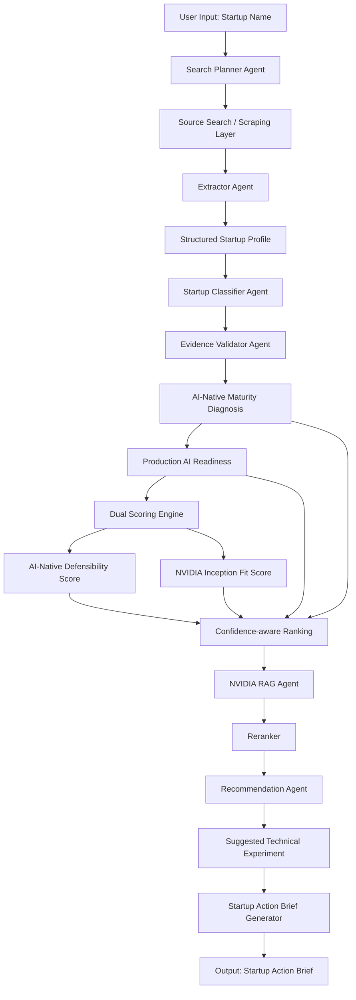

# Case Plan: NVIDIA Startup AI Radar

> **ARCHIVED:** Historical case/MVP plan. The product direction is now documented in `docs/54_final_product_backlog.md`. This document is preserved for historical reference only and should not guide current implementation.

> **Opportunity Intelligence for NVIDIA Inception**
>
> Uma plataforma multiagente que transforma sinais públicos de startups brasileiras em um ranking acionável, combinando agentes de coleta, validação de evidências, classificação AI-native, Production AI Readiness, AI-Native Defensibility Score e NVIDIA Inception Fit Score. O sistema diagnostica production AI gaps, recupera playbooks NVIDIA via RAG e gera um Startup Action Brief com prioridade, evidências, tecnologias recomendadas, experimento técnico sugerido e próxima ação para o time de Startups & VCs.

---

## Tese Final

O NVIDIA Startup AI Radar é uma plataforma de **Opportunity Intelligence** para o programa NVIDIA Inception no Brasil. Diferente de ferramentas de market intelligence genéricas, o Radar combina:

- **Agentes autônomos** que coletam e validam evidências públicas
- **Dual Scoring Engine** que avalia defensibilidade AI-native e fit com ecossistema NVIDIA
- **Confidence-aware Ranking** que nunca esconde a incerteza das fontes
- **Startup Action Brief** que entrega não apenas diagnóstico, mas um experimento técnico concreto sugerido

O objetivo não é substituir o julgamento humano, mas escalá-lo com rastreabilidade e rigor técnico.

---

## Problema Estratégico

A NVIDIA Inception busca identificar, atrair e nutrir startups brasileiras AI-native com potencial de escala e adoção de infraestrutura NVIDIA. Porém:

| Problema | Consequência |
|---|---|
| Time comercial não consegue analisar centenas de startups manualmente | Oportunidades perdidas, esforço concentrado em poucos leads |
| Startups LLM-wrapper parecem AI-native superficialmente | Risco de investir relacionamento em empresas sem defensibilidade |
| Evidências públicas estão espalhadas e não são validadas | Decisões baseadas em autodeclaração, não em fatos |
| Gaps técnicos não são mapeados a tecnologias NVIDIA | Recomendações genéricas sem justificativa técnica |
| Não há ranking padronizado para priorizar outreach | Time reativo em vez de proativo |

O Radar resolve esses problemas com uma pipeline auditável que vai do sinal público ao brief acionável.

---

## Usuário Final

| Perfil | Descrição |
|---|---|
| **Gerente de Startups & VCs (NVIDIA Brasil)** | Responsável por identificar startups promissoras, avaliar fit com NVIDIA, e recomendar engajamento técnico-comercial |
| **Analista de Ecosystem** | Suporta a triagem, coleta de evidências e preparação de briefings |
| **Arquiteto de Soluções NVIDIA** | Usa os diagnósticos técnicos para preparar experimentos e POCs |

**Caso de uso primário:** Um gerente Inception quer priorizar 5 startups de um universo de 50 para uma campanha de Q2. O Radar entrega um ranking com scores, evidências e recomendações técnicas em minutos, não semanas.

---

## Antes vs Depois

| Dimensão | Antes (manual) | Depois (Radar) |
|---|---|---|
| Triagem de startup | Dias de pesquisa manual | Minutos com pipeline automatizada |
| Evidências | Planilhas, abas abertas, anotações soltas | Fontes registradas com URL, data e confiança |
| Classificação AI-native | Palpite baseado em site/pitch | Matriz de maturidade com evidências por nível |
| Recomendação NVIDIA | Template genérico | Gap técnico explícito → tecnologia mapeada |
| Priorização | Intuição, relacionamento anterior | Dual score + ranking ponderado por confiança |
| Ação seguinte | "Vamos marcar uma call" | Experimento técnico sugerido + próxima ação concreta |
| Rastreabilidade | Quem viu o quê? Baseado em quê? | Toda decisão tem fonte, toda fonte tem metadata |

---

## Proposta de Valor para NVIDIA

1. **Escalar relacionamento**: dezenas de startups analisadas em paralelo com qualidade consistente
2. **Reduzir ruído de wrapper fallacy**: classificação AI-native rigorosa separa startups reais de encapsuladores de LLM
3. **Aceleração técnica direcionada**: gaps explícitos mapeados para NVIDIA solutions (TensorRT-LLM, RAPIDS, NeMo, Riva, Isaac)
4. **Briefings executivos prontos para ação**: time comercial chega na conversa sabendo o que recomendar
5. **Diferencial competitivo**: NVIDIA é a única provedora de infraestrutura com capacidade de diagnosticar maturidade técnica de startups em escala

---

## MVP

### O que o MVP faz

Input: nome de uma startup brasileira.

Output: **NVIDIA Startup Action Brief** contendo:
- Classificação AI-native (nível 0-4) com evidências
- AI-Native Defensibility Score (0-100)
- NVIDIA Inception Fit Score (0-100)
- Gaps técnicos identificados
- Tecnologias NVIDIA recomendadas com justificativa
- Suggested Technical Experiment
- Próxima ação sugerida
- Fontes e confiança das evidências

### O que o MVP NÃO faz

- Não tem interface web (output via CLI ou API response)
- Não faz scraping autônomo em larga escala (coleta dirigida por input)
- Não tem RAG completo com Qdrant (playbooks NVIDIA podem ser mockados ou carregados estaticamente)
- Não tem human-in-the-loop integrado (revisão é manual após output)
- Não compara múltiplas startups simultaneamente
- Não persiste dados em banco (output é único por execução)

---

## Verticais Prioritárias

| Vertical | Justificativa | Tecnologias NVIDIA mais relevantes |
|---|---|---|
| **HealthTech** | Dados sensíveis, necessidade de inferência controlada, regulatório | TensorRT-LLM, NeMo Guardrails, Riva |
| **FinTech** | Baixa latência crítica, processamento tabular pesado | RAPIDS, cuDF, TensorRT-LLM |
| **AgTech** | Visão computacional, inferência em borda, dados de sensor | TensorRT, DeepStream, Isaac |
| **LegalTech** | Processamento de linguagem jurídica, agentes com governança | NeMo, NeMo Guardrails |
| **EdTech** | Personalização em escala, processamento de áudio/texto | Riva, TensorRT-LLM |

---

## Arquitetura Funcional



### Nós da Arquitetura

| Nó | Descrição |
|---|---|
| **Search Planner Agent** | Define objetivos de coleta, fontes-alvo e lacunas esperadas |
| **Source Search / Scraping Layer** | Busca páginas públicas permitidas e registra metadados |
| **Extractor Agent** | Converte texto cru em fatos estruturados e evidências rastreáveis |
| **Structured Startup Profile** | Contrato de dados principal para a startup analisada |
| **Startup Classifier Agent** | Classifica nível AI-native (0-4) com base em critérios documentados |
| **Evidence Validator Agent** | Separa fatos, inferências e hipóteses; atribui confiança |
| **AI-Native Maturity Diagnosis** | Resume maturidade, riscos e sinais de defensibilidade |
| **Production AI Readiness** | Avalia se startup tem observability, deployment pipeline, governança de modelo |
| **Dual Scoring Engine** | Computa Defensibility Score + Inception Fit Score |
| **Confidence-aware Ranking** | Pondera scores por confiança das evidências, cobertura de fontes, consistência |
| **NVIDIA RAG Agent** | Recupera playbooks e tecnologias NVIDIA relevantes |
| **Reranker** | Prioriza trechos mais úteis antes da recomendação |
| **Recommendation Agent** | Mapeia gaps técnicos para tecnologias NVIDIA candidatas |
| **Suggested Technical Experiment** | Gera experimento concreto baseado no gap de maior prioridade |
| **Startup Action Brief Generator** | Monta brief executivo completo |

---

## Dual Scoring Engine

O Dual Scoring Engine combina duas perspectivas complementares:

### AI-Native Defensibility Score (0-100)

Avalia o quanto a startup é defensível diante de concorrentes e modelos fundacionais.

| Dimensão | Peso | O que mede |
|---|---|---|
| Dependência real de IA no core do produto | 25% | A startup para de funcionar sem IA? |
| Dados proprietários | 20% | Tem data moat? Dados exclusivos? |
| Integração com workflow operacional | 15% | A IA está embarcada em processo real? |
| Aprendizado acumulado com uso real | 15% | Ciclo de feedback com dados de produção? |
| Complexidade de replicação | 15% | Quão difícil seria copiar? |
| Potencial de aceleração com NVIDIA | 10% | Gap técnico que NVIDIA preenche? |

### NVIDIA Inception Fit Score (0-100)

Avalia o alinhamento da startup com o ecossistema NVIDIA.

| Dimensão | Peso | O que mede |
|---|---|---|
| Gap taxonômico explícito (ver 12_gap_taxonomy.md) | 35% | A startup tem gaps que NVIDIA resolve? |
| Alinhamento com vertical prioritária | 25% | A startup opera em HealthTech, FinTech, AgTech, LegalTech, EdTech? |
| Maturidade técnica para adoção | 20% | Tem time, infra e escala para usar tecnologia NVIDIA? |
| Potencial de receita/relacionamento para NVIDIA | 20% | Crescimento, captação, tração de mercado |

### Score Composto

Score final = α × Defensibility + β × Inception Fit, onde α e β são configuráveis por contexto:
- **Hunter mode** (β > α): prioriza fit comercial com NVIDIA
- **Quality mode** (α > β): prioriza startups mais defensíveis

---

## Production AI Readiness

Dimensão de diagnóstico adicional que avalia se a startup está pronta para produção com IA:

| Critério | O que verifica |
|---|---|
| **Observability** | Monitoramento de modelos em produção? Logs de inferência? |
| **Deployment pipeline** | CI/CD para modelos? Infraestrutura como código? |
| **Model governance** | Versionamento de modelo? Testes de regressão? |
| **Quality evaluation** | Métricas de qualidade em produção? Avaliação offline? |
| **Scalability** | Arquitetura preparada para escala horizontal? |
| **Security & compliance** | Controles de acesso, privacidade, LGPD? |

**Output:** Perfil de readiness (incipiente / em desenvolvimento / maduro) com evidências.

---

## Confidence-aware Ranking

O ranking não trata todas as startups igualmente — ele expõe a incerteza.

### Fatores de confiança

| Fator | Peso | Descrição |
|---|---|---|
| Cobertura de fontes | 40% | Quantas fontes nível 1/2/3 foram coletadas |
| Consistência interna | 30% | Evidências convergem ou contradizem? |
| Proporção fato vs inferência | 20% | Quanto do diagnóstico é fato vs hipótese |
| Recência das fontes | 10% | Fontes têm menos de 12 meses? |

### Regras de exibição

- **Confiança alta** (≥70%): score exibido sem ressalvas
- **Confiança média** (40-69%): score exibido com badge "Confiança média — revisar evidências"
- **Confiança baixa** (<40%): score exibido com badge "Confiança baixa — coletar mais fontes"

O ranking nunca esconde uma startup promissora por falta de dados, mas nunca a superestima.

---

## NVIDIA Startup Action Brief

Template executivo completo:

```markdown
# Startup Action Brief: [Nome]

## Score Card
- AI-Native Defensibility Score: XX/100
- NVIDIA Inception Fit Score: XX/100
- Score Composto: XX/100 (modo: hunter/quality)
- Confidence: Alta / Média / Baixa

## Classificação AI-native
Nível X — [Non-AI / AI-assisted / AI-enabled / AI-native / AI-native service]

## Production AI Readiness
[Perfil de readiness com evidências]

## Technical Gaps
1. Gap A — Evidência: [fonte]
2. Gap B — Evidência: [fonte]

## NVIDIA Recommendations
1. Gap A → Tecnologia NVIDIA X — Justificativa técnica
2. Gap B → Tecnologia NVIDIA Y — Justificativa técnica

## Suggested Technical Experiment
**Título:** [nome do experimento]
**Gap alvo:** [gap que o experimento endereça]
**Hipótese:** [o que esperamos que aconteça]
**Métrica sugerida:** [como medir sucesso]
**Duração estimada:** [dias/semanas]
**Tecnologia NVIDIA envolvida:** [tecnologia]
**Próximo passo concreto:** [ação específica]

## Próxima Ação
[Recomendação de ação comercial/técnica]

## Evidências
- [URL 1] — Fato — Nível 1 — Acessado em [data]
- [URL 2] — Inferência — Nível 2 — Acessado em [data]
```

---

## Suggested Technical Experiment

O experimento técnico sugerido é o grande diferencial do Radar vs ferramentas de inteligência tradicionais.

### Critérios de qualidade

| Critério | Descrição |
|---|---|
| **Específico** | Não é "use NVIDIA", é "substitua inferência CPU por TensorRT-LLM no endpoint X" |
| **Hipotético** | Explicitamente marcado como experimento sugerido, não como diagnóstico |
| **Acionável** | Um engenheiro sênior entende o que fazer em 5 minutos |
| **Mensurável** | Inclui métrica de sucesso (ex.: latência p75, throughput, custo por inferência) |
| **Baseado em gap** | Todo experimento nasce de um gap técnico real identificado na coleta |

### Exemplo

```
**Título:** Acelerar inferência de LLM com TensorRT-LLM
**Gap alvo:** high_inference_cost + high_latency
**Hipótese:** Substituir a inferência via API OpenAI por um endpoint
  TensorRT-LLM auto-hospedado reduz latência p75 em 60% e custo
  por token em 70% para o volume atual de 50k req/dia.
**Métrica sugerida:** Latência p75, custo por inferência, taxa de erro
**Duração estimada:** 2-4 semanas
**Tecnologia NVIDIA envolvida:** TensorRT-LLM, Triton Inference Server
**Próximo passo concreto:** Compartilhar benchmark público do TensorRT-LLM
  com CTO da startup e oferecer créditos NVIDIA LaunchPad para POC.
```

---

## Critérios de Sucesso

| Critério | Métrica | Como medir |
|---|---|---|
| Classificação correta | ≥80% das classificações AI-native corretas em revisão manual | Review trimestral com especialista NVIDIA |
| Ranking útil | Ranking Top-5 tem sobreposição ≥60% com ranking de especialista | Comparação cega |
| Briefing acionável | Briefing é útil para outreach em ≤2 min de leitura | Teste com time NVIDIA |
| Experimento plausível | Experimento é tecnicamente válido em ≥70% dos casos | Revisão por arquiteto de soluções |
| Confiança honesta | Bandeira de baixa confiança acende quando fontes são insuficientes | Testes com cenários de evidência parcial |

---

## Escopo Fora do MVP

| Funcionalidade | Quando |
|---|---|
| Interface web (Streamlit) | Pós validação da pipeline |
| RAG completo com Qdrant | Épico dedicado |
| Scraping autônomo agendado | Pós validação de fontes |
| Comparação entre startups | Fase de diferenciação |
| Human-in-the-loop review | Fase de diferenciação |
| Dashboard executivo | Fase de briefing |
| Integração CRM (Salesforce) | Pós MVP validado |
| Export para decks e apresentações | Fase de briefing |

---

## Riscos e Mitigação

| Risco | Probabilidade | Impacto | Mitigação |
|---|---|---|---|
| Escopo excessivo compromete entrega | Média | Alto | MVP claramente definido; entregas pequenas e testáveis |
| Evidência pública insuficiente para startup brasileira | Alta | Médio | Confidence-aware ranking expõe; bandeira de baixa confiança |
| Score mal calibrado vs julgamento humano | Média | Alto | Validação manual periódica; pesos configuráveis |
| Doc-code drift entre docs e implementação | Alta | Médio | Toda seção do case plan tem status; update síncrono com código |
| Experimento técnico não validado por especialista NVIDIA | Média | Médio | Template paramétrico sem alucinar detalhes; revisão externa |
| Dependência de API de terceiros (OpenAI, Cohere) | Baixa | Alto | Fallback para modelo local; custo monitorado |

---

## Demo Final

**Cenário:** Startup brasileira AI-native real (ex.: uma empresa que usa IA generativa para atendimento ao cliente, tem site público, LinkedIn, blog técnico, página de carreiras).

**Fluxo da demo:**

1. **Input:** Nome da startup + contexto (vertente de atuação, mercado)
2. **Pipeline automática:** Search Planner → busca em fontes nível 1/2 → extração → classificação → validação
3. **Dual Scoring:** Defensibility Score + Inception Fit Score + Score Composto
4. **Production AI Readiness:** Diagnóstico de maturidade de produção
5. **Confidence-aware Ranking:** Posição no ranking com badge de confiança
6. **NVIDIA RAG:** Recuperação de playbooks relevantes
7. **Recomendação:** Gaps → tecnologias → justificativa
8. **Suggested Technical Experiment:** Experimento concreto sugerido
9. **Startup Action Brief:** Documento completo em markdown
10. **Próxima ação:** Recomendação comercial/técnica explícita

**Duração estimada:** 3-5 minutos de demonstração.

---

## Roadmap por Épicos

### Épico 0 — Case Consolidation (atual)
- ✅ docs/00_case_plan.md
- ✅ docs/08_demo_script.md atualizado
- ✅ docs/09_user_workflow.md atualizado
- ✅ ROADMAP.md atualizado
- ✅ DECISIONS.md atualizado
- ✅ README.md atualizado

### Épico 1 — Dual Scoring Engine
- Implementar AI-Native Defensibility Score (lógica, pesos, validação)
- Implementar NVIDIA Inception Fit Score
- Implementar score composto com pesos configuráveis
- Testes com golden examples
- Documentação dos algoritmos

### Épico 2 — Confidence-aware Ranking
- Algoritmo de ranking ponderado por confiança
- Badges de confiança (alta/média/baixa)
- Testes com cenários de evidência parcial
- Validação contra ranking manual

### Épico 3 — Suggested Technical Experiment
- Template de experimento
- Lógica de recomendação baseada em gap de maior prioridade
- Validação com arquiteto de soluções NVIDIA
- Testes de plausibilidade técnica

### Épico 4 — Startup Action Brief
- Montagem do brief completo
- Output em markdown e JSON
- Testes de completeza e acionabilidade
- Integração com pipeline existente

### Épico 5 — Demo Integration
- Script de demo funcional (CLI)
- Cenário único ponta-a-ponta
- Documentação de apresentação
- Preparação para validação com time NVIDIA

---

## Status deste Documento

- **Versão:** 1.0
- **Status:** Planejado (documento de case, não implementação)
- **Próxima atualização:** Ao final do Épico 1

---

*Este documento é o ponto de partida executivo para o NVIDIA Startup AI Radar. Consulte `00_project_brief.md` para a visão sucinta original e `02_architecture.md` para o detalhamento técnico da arquitetura.*
