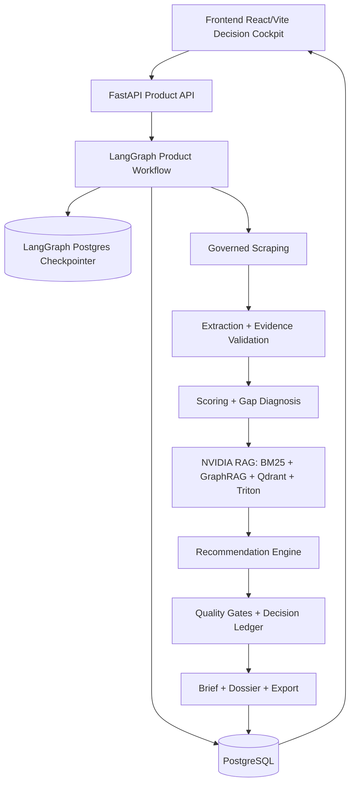

# 01 — Arquitetura Geral

## Responsabilidade deste documento

Este documento descreve a arquitetura geral do produto, os limites entre camadas, o runtime único e os contratos globais de governança. Ele não detalha internamente scraping, LangGraph, RAG, recomendação ou frontend; esses detalhes estão nos documentos específicos.

## Objetivo arquitetural

O NVIDIA Startup AI Radar é um sistema de inteligência para apoiar a NVIDIA na identificação, qualificação e nutrição de startups brasileiras com potencial AI-native. O produto transforma dados públicos em uma decisão operacional:

> abordar agora, validar manualmente, monitorar ou não recomendar.

A arquitetura foi desenhada para evitar uma demo superficial. O runtime final precisa ser:

- centralizado em uma única pipeline;
- rastreável por evidência;
- fail-closed em produção;
- quantitativo sempre que houver score/threshold/ranking;
- adaptativo quando houver evidência insuficiente;
- visível no frontend com todos os artefatos coletados e gerados.

## Camadas do sistema



## Camada 1 — Frontend

Tecnologias:

- React 19;
- TypeScript 6;
- Vite 8;
- Playwright para E2E.

Responsabilidade arquitetural:

- mostrar readiness/setup;
- iniciar pipeline principal;
- acompanhar workflow;
- mostrar resultado final em ordem de decisão;
- expor todas as evidências, gaps, recomendações, contextos RAG, quality gates e export.

Detalhes internos estão em `06_FRONTEND_DECISION_COCKPIT.md`.

## Camada 2 — API de produto

Tecnologia principal:

- FastAPI.

Responsabilidade:

- expor endpoints de startups, runs, evidências, claims, dossiers, exports, workflow e radar dashboard;
- não executar lógica paralela fora da pipeline produtiva;
- validar readiness/configuração;
- conectar frontend ao banco e ao LangGraph workflow.

Endpoints centrais:

| Endpoint | Papel |
|---|---|
| `POST /workflows/product-runs` | única entrada produtiva para rodar a pipeline final |
| `GET /workflows/{id}` | estado, nós e snapshots do workflow |
| `POST /workflows/{id}/resume` | retomada de human review |
| `GET /analysis-runs/{id}` | detalhes do run persistido |
| `GET /analysis-runs/{id}/evidence-bundle` | evidências e claims |
| `GET /analysis-runs/{id}/dossier` | activation dossier |
| `GET /radar/dashboard` | cockpit agregado de empresas |
| `GET /product/readiness` | readiness de produto |

## Camada 3 — Workflow central

Tecnologia:

- LangGraph `StateGraph`;
- PostgreSQL checkpointer;
- `ProductWorkflowState` como estado único.

Responsabilidade arquitetural:

- orquestrar todos os nós em ordem fixa e auditável;
- persistir node runs;
- aplicar retry;
- falhar fechado em produção;
- pausar/retomar human-in-the-loop;
- executar loop adaptativo quando mais evidência é solicitada.

Detalhes internos estão em `03_SISTEMA_MULTIAGENTE_LANGGRAPH.md`.

## Camada 4 — Persistência

Tecnologias:

- PostgreSQL;
- SQLAlchemy;
- Alembic;
- LangGraph Postgres checkpointer.

Dados persistidos:

- startups;
- discovery candidates;
- analysis runs;
- evidências;
- scores;
- gaps;
- NVIDIA mappings;
- activation recommendations;
- claims;
- dossiers;
- exports;
- workflow runs;
- node runs;
- readiness checks;
- quality runs.

## Camada 5 — Governança e qualidade

Tecnologias/artefatos:

- `config/quantitative_parameters.yaml`;
- `config/rag_retrieval.yaml`;
- `config/techniques.yaml`;
- decision calibration registry;
- quality evaluators;
- decision ledger CSV;
- readiness service;
- release checks.

Responsabilidades:

- impedir runtime mock/demo;
- impedir recomendação sem RAG;
- impedir recomendação sem evidência mínima;
- registrar blockers;
- gerar rastreabilidade de decisões;
- expor readiness e quality gates para o frontend.

## Runtime único

A arquitetura usa uma única rota produtiva:

```http
POST /workflows/product-runs
```

Qualquer caminho alternativo deve ser tratado como:

- ferramenta de desenvolvimento;
- avaliação offline;
- benchmark;
- migração interna;
- ou deve ser removido se gerar output concorrente.

## Ordem da pipeline produtiva

```text
preflight_configuration_check
→ load_startup_or_candidate
→ plan_search
→ collect_sources
→ extract_profile
→ validate_evidence
→ score_startup_probabilistic
→ diagnose_gaps
→ retrieve_nvidia_context
→ enhance_contexts_with_techniques
→ map_nvidia_technologies
→ rank_recommendations
→ rank_with_expected_utility
→ generate_brief
→ run_quality_gates
→ generate_claims
→ match_activation_playbooks
→ generate_activation_dossier
→ run_product_quality
→ summarize_readiness
→ needs_review
→ apply_feedback_weights
→ write_decision_ledger
→ finish
```

Loop adaptativo:

```text
needs_review = request_more_evidence
→ apply_feedback_weights
→ write_decision_ledger
→ plan_missing_information
→ collect_sources
→ extract_profile
→ validate_evidence
→ score_startup_probabilistic
→ ...
```

## Contratos entre camadas

### Entrada mínima de startup

```json
{
  "startup_id": "uuid",
  "name": "Nome da startup",
  "website": "https://...",
  "sector": "..."
}
```

### Saída esperada do scraping

```json
{
  "raw_evidence": [],
  "collection_metrics": {},
  "source_errors": []
}
```

### Saída esperada de extração/validação

```json
{
  "startup_profile": {},
  "evidence_items": [],
  "validated_evidence": []
}
```

### Saída esperada de scoring/gaps

```json
{
  "scores": {},
  "gap_diagnosis_summary": {},
  "gap_ids": []
}
```

### Saída esperada do RAG

```json
{
  "rag_contexts_by_gap": {},
  "rag_retrieval_metrics": {},
  "rag_retrieval_status": "passed"
}
```

### Saída esperada do motor de recomendação

```json
{
  "nvidia_recommendations": [],
  "ranking_status": "passed",
  "production_allowed": true,
  "blockers": []
}
```

### Saída esperada para frontend

```json
{
  "workflow": {},
  "startup_profile": {},
  "scores": {},
  "gaps": [],
  "recommendations": [],
  "claims": [],
  "evidence_bundle": {},
  "rag_contexts": [],
  "quality": {},
  "brief": {},
  "dossier": {},
  "export": {}
}
```

## Política de “tudo ativo no runtime”

A arquitetura distingue três categorias:

| Categoria | Regra |
|---|---|
| Runtime productivo | Pode aparecer como funcionalidade do produto |
| Benchmark/lab | Pode existir no repositório, mas não pode ser vendido como ativo |
| Código morto | Deve ser removido ou migrado para benchmark/lab |

Critério objetivo:

- se a funcionalidade é chamada pela pipeline `POST /workflows/product-runs`, é runtime;
- se é chamada apenas por teste/script/eval, é benchmark/lab;
- se não é chamada, não tem teste e não aparece em docs, é candidato a remoção.

## Componentes produtivos principais

| Área | Runtime produtivo |
|---|---|
| API | FastAPI product/workflow routes |
| Orquestração | LangGraph `StateGraph` |
| Coleta | `plan_search`, `collect_governed_sources`, `HttpSourceCollector` |
| Extração | extractor agent + Pydantic schemas |
| Validação | evidence validator + support levels |
| Scoring | probabilistic scoring + calibration registry |
| Gaps | quantitative gap diagnosis |
| RAG | QdrantRagService + BM25 + GraphRAG + Triton reranker |
| Recomendação | NVIDIA mapping + recommendation ranking + expected utility |
| Qualidade | quality gates + readiness + decision ledger |
| UI | Decision Cockpit + Radar Dashboard + Final Result |

## Políticas de falha

Em `APP_MODE=product`:

- nós críticos com `FAILED`, `DEGRADED` ou `SKIPPED` falham fechado;
- RAG é obrigatório;
- reranker não pode ser `mock`, `noop`, `none` ou vazio;
- Qdrant precisa estar configurado;
- LangGraph precisa estar ativo;
- PostgreSQL precisa ser usado;
- source collection precisa seguir governança;
- recomendações sem suporte são bloqueadas.

## Auditoria e rastreabilidade

Cada execução deve permitir responder:

1. Qual startup foi analisada?
2. Quais fontes foram tentadas?
3. Quais fontes foram coletadas?
4. Quais claims foram extraídos?
5. Quais claims foram aceitos, fracos ou rejeitados?
6. Quais scores foram calculados?
7. Quais gaps foram diagnosticados?
8. Quais contextos NVIDIA foram recuperados?
9. Qual tecnologia NVIDIA foi recomendada?
10. Qual foi a ação recomendada?
11. O que bloqueou a entrega?
12. Qual output foi mostrado/exportado?

## Arquivos de configuração globais

| Arquivo | Papel |
|---|---|
| `.env.example` | template de runtime produtivo |
| `docker-compose.yml` | serviços locais obrigatórios |
| `pyproject.toml` | dependências backend |
| `frontend/package.json` | dependências frontend |
| `config/rag_retrieval.yaml` | parâmetros de retrieval |
| `config/techniques.yaml` | grupos de técnicas RAG/enhancement |
| `config/quantitative_parameters.yaml` | parâmetros quantitativos |
| `config/decisioning.yaml` | decisões e thresholds |
| `config/source_quality.yaml` | qualidade de fontes |
| `config/eval_thresholds.yaml` | thresholds de avaliação |

## Validação arquitetural mínima

```bash
python scripts/check_product_configuration.py
python scripts/check_single_runtime_pipeline.py
python scripts/check_no_mock_runtime.py
python scripts/check_no_demo_dependency.py
python scripts/check_runtime_usage_inventory.py || true
```

O último comando pode variar conforme o script disponível; a regra é manter inventário de uso ativo.

## Critérios de aceite arquitetural

| Critério | Aceite |
|---|---|
| Runtime único | Toda entrega final nasce de `POST /workflows/product-runs` |
| Configuração | `check_product_configuration.py` passa |
| Persistência | PostgreSQL configurado para produto |
| Orquestração | LangGraph ativo e checkpointer PostgreSQL |
| RAG | Qdrant + BM25 + GraphRAG + Triton configurados |
| Recomendação | bloqueia sem evidência/RAG |
| Frontend | mostra tudo em Decision Cockpit |
| Auditoria | decision ledger gerado |
| Export | brief/dossier/export gerados a partir da run |
