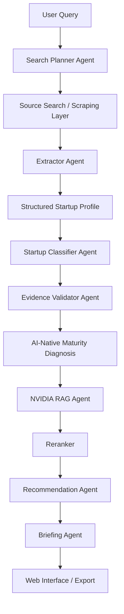

# Arquitetura

## Nos da arquitetura

- `User Query`: dispara uma investigacao ou avaliacao de startup.
- `Search Planner Agent`: define objetivos de coleta, fontes-alvo e lacunas esperadas.
- `Source Search / Scraping Layer`: busca paginas publicas permitidas e registra metadados.
- `Extractor Agent`: converte texto cru em fatos estruturados e evidencias rastreaveis.
- `Structured Startup Profile`: representa o contrato de dados principal para a startup analisada.
- `Startup Classifier Agent`: classifica o nivel AI-native com base em criterios documentados.
- `Evidence Validator Agent`: separa fatos, inferencias e hipoteses e atribui confianca.
- `AI-Native Maturity Diagnosis`: resume maturidade, riscos e sinais de defensibilidade.
- `NVIDIA RAG Agent`: recupera tecnologias e documentos NVIDIA relevantes.
- `Reranker`: prioriza os trechos mais uteis antes da recomendacao.
- `Recommendation Agent`: mapeia gaps tecnicos para tecnologias NVIDIA candidatas.
- `Briefing Agent`: gera um briefing executivo curto e acionavel.
- `Web Interface / Export`: camada futura de consumo, revisao e compartilhamento.
