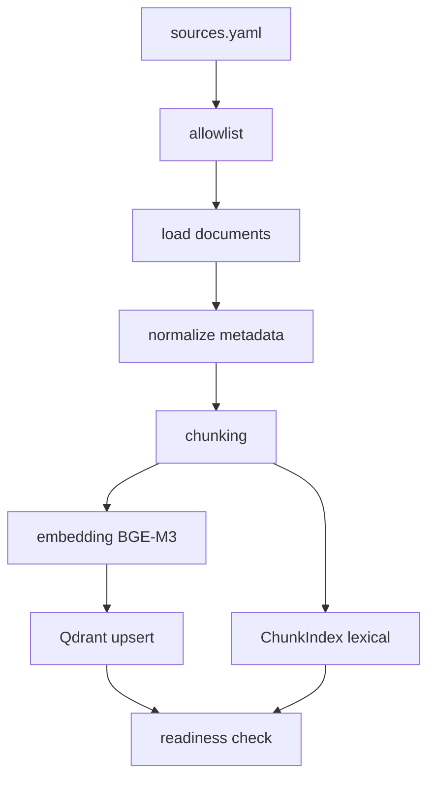
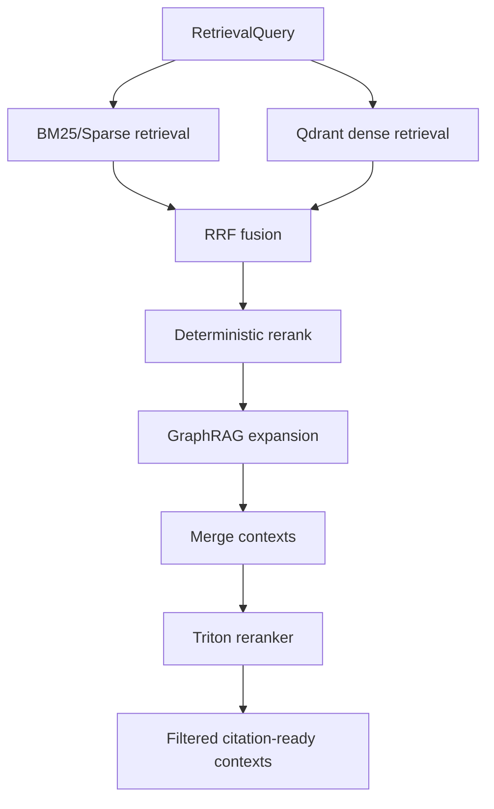

# 04 — RAG NVIDIA com Reranking

## Responsabilidade deste documento

Este documento descreve apenas o subsistema RAG NVIDIA: corpus, ingestão, chunking, embeddings, Qdrant, BM25, GraphRAG, fusão, reranking Triton, citações, métricas e gates. Ele não descreve coleta de startups, LangGraph em detalhes, recomendação ou frontend.

## Objetivo do RAG NVIDIA

O RAG NVIDIA garante que cada recomendação de tecnologia NVIDIA seja sustentada por contexto oficial ou governado sobre produtos NVIDIA. O sistema não deve recomendar NIM, Triton, NeMo, RAPIDS, Riva, Isaac, Clara ou qualquer tecnologia apenas por regra estática; precisa recuperar contexto citável e relevante.

## Entrada do RAG

O RAG recebe:

```json
{
  "gap_diagnosis_summary": {},
  "startup_profile": {},
  "accepted_evidence_items": []
}
```

Entrada conceitual:

- gaps detectados;
- tipo de gap;
- evidências da startup;
- setor/produto/stack;
- tecnologias NVIDIA candidatas derivadas do gap.

## Saída do RAG

```json
{
  "rag_queries_by_gap": {},
  "rag_contexts": [],
  "rag_contexts_by_gap": {},
  "rag_retrieval_status": "passed|blocked|failed",
  "rag_retrieval_metrics": {},
  "status": "rag_passed",
  "blockers": []
}
```

Cada contexto deve conter:

```json
{
  "context_id": "...",
  "chunk_id": "...",
  "gap_id": "...",
  "gap_types": ["..."],
  "source_id": "...",
  "nvidia_technology": "NVIDIA NIM",
  "product": "NVIDIA NIM",
  "title": "...",
  "snippet": "...",
  "content": "...",
  "url": "https://...",
  "retrieval_score": 0.0,
  "rerank_score": 0.0,
  "relevance_score": 0.0,
  "retrieval_mode": "bm25_graphrag_qdrant_triton_rerank",
  "bm25_active": true,
  "graphrag_active": true,
  "triton_reranker_active": true,
  "citation_ready": true
}
```

## Arquivos principais

| Arquivo | Responsabilidade |
|---|---|
| `src/rag/rag_service_factory.py` | `QdrantRagService`, path oficial de retrieval |
| `src/rag/ingestion_pipeline.py` | ingestão e readiness do corpus |
| `src/rag/ingestion.py` | modelos/processos de ingestão |
| `src/rag/chunking.py` | heading + recursive chunking |
| `src/rag/embeddings.py` | providers de embedding |
| `src/rag/qdrant_store.py` | conexão/coleção Qdrant |
| `src/rag/retrieval.py` | índice local/ChunkIndex |
| `src/rag/sparse_retrieval.py` | retrieval lexical/BM25-like |
| `src/rag/semantic_retrieval.py` | retrieval denso com vector store |
| `src/rag/hybrid_retrieval.py` | fusão BM25 + dense + GraphRAG |
| `src/rag/graphrag_runtime.py` | expansão GraphRAG ativa |
| `src/rag/reranking.py` | reranking determinístico local |
| `src/rag/triton_reranker.py` | reranking neural via Triton |
| `src/rag/schemas.py` | schemas de RAG |
| `data/nvidia_corpus/sources.yaml` | registry de fontes NVIDIA |
| `data/nvidia_corpus/source_allowlist.yaml` | allowlist de produção |
| `config/rag_retrieval.yaml` | configuração de retrieval |
| `config/techniques.yaml` | grupos de técnicas de enhancement |

## Tecnologias usadas

| Tecnologia | Uso |
|---|---|
| Qdrant | vector database para embeddings NVIDIA |
| `qdrant-client` | cliente Python Qdrant |
| BAAI/bge-m3 | embedding multilíngue, dimensão 1024 |
| `sentence-transformers` | execução local de embeddings |
| BM25 / sparse retrieval | busca lexical por termos técnicos |
| Reciprocal Rank Fusion | fusão de rankings lexical/dense/graph |
| GraphRAG runtime local | expansão por entidades/produtos/fontes/gaps |
| NVIDIA Triton Inference Server | endpoint de reranking neural |
| `httpx` | chamada HTTP ao Triton |
| Pydantic | schemas de contextos, queries e documentos |
| YAML | configuração de corpus e retrieval |

## Corpus NVIDIA

O corpus deve conter documentação governada sobre:

- NVIDIA Inception;
- NVIDIA NIM;
- NVIDIA API Catalog / Build;
- NVIDIA NeMo;
- NeMo Guardrails;
- NVIDIA Triton Inference Server;
- TensorRT-LLM;
- RAPIDS;
- cuDF;
- cuML;
- CUDA;
- Riva;
- Omniverse;
- Isaac;
- Clara / MONAI;
- Morpheus;
- NVIDIA AI Enterprise;
- AI Blueprints;
- whitepapers ou materiais oficiais relevantes.

## Regra de corpus de produção

Somente fontes ativas e permitidas em `sources.yaml`/allowlist devem entrar na ingestão produtiva.

Arquivos de teste, staging temporário ou archive não podem contaminar o corpus ativo. Se existirem no repositório, o loader produtivo precisa ignorá-los por allowlist.

## Ingestão

Fluxo esperado:



Campos obrigatórios por chunk:

- `source_id`;
- `url`;
- `title`;
- `product` ou `nvidia_technology`;
- `content`;
- `chunk_id`;
- `chunk_index`;
- `corpus_version`;
- `content_hash`;
- `gap_types` quando aplicável;
- `ingested_at`.

## Chunking

Arquivo: `src/rag/chunking.py`.

Estratégia:

1. headings Markdown;
2. parágrafos;
3. linhas;
4. sentenças;
5. cláusulas;
6. palavras/janela de caracteres.

Configuração padrão:

```yaml
chunking:
  chunk_size: 512
  overlap: 64
  strategy: recursive
  actual_strategy: heading + recursive fallback
```

Objetivo:

- preservar contexto por seção;
- evitar chunks grandes demais;
- manter citações compactas;
- permitir recuperação por tecnologia/gap.

## Embeddings

Configuração:

```env
RAG_EMBEDDING_MODEL=BAAI/bge-m3
QDRANT_VECTOR_SIZE=1024
```

Motivo:

- nomes técnicos em inglês;
- consultas em português/inglês;
- suporte multilíngue;
- bom desempenho para retrieval técnico.

Regra de produção:

- se `sentence-transformers` ou provider de embedding não estiver disponível, RAG deve falhar fechado;
- vector size precisa bater com coleção Qdrant;
- coleção vazia bloqueia recomendações.

## Query generation por gap

Para cada gap, o RAG constrói query com:

- nome do gap;
- technical gaps relacionados;
- tecnologias NVIDIA candidatas;
- setor da startup;
- product summary;
- technical keywords;
- termos extraídos de evidência.

Exemplo:

```text
high inference cost TensorRT-LLM Triton NIM latency cost LLM inference customer support
```

## Retrieval oficial

Modo:

```env
RAG_RETRIEVAL_MODE=bm25_graphrag_qdrant_triton_rerank
```

Fluxo por gap:



## BM25 / sparse retrieval

Uso:

- recuperar termos exatos como `NIM`, `Triton`, `RAPIDS`, `cuDF`, `NeMo`, `Riva`;
- evitar que embedding ignore siglas;
- sustentar precisão em consultas curtas.

## Dense retrieval com Qdrant

Uso:

- recuperar conceitos semanticamente próximos;
- lidar com variações de linguagem;
- conectar gaps a soluções NVIDIA mesmo sem match exato.

Qdrant precisa estar ativo e populado:

```env
QDRANT_URL=http://localhost:6333
QDRANT_COLLECTION=nvidia_corpus
```

## Reciprocal Rank Fusion

O RAG usa RRF para combinar rankings:

```text
score += 1 / (RRF_K + rank + 1)
```

Configuração:

```yaml
hybrid:
  rrf_k: 60
  dense_weight: 0.4
  bm25_weight: 0.35
  graphrag_weight: 0.25
```

Observação: a implementação atual normaliza score final após fusão; pesos configurados devem ser mantidos sincronizados com o código se a fusão ponderada for expandida.

## GraphRAG runtime

Arquivo: `src/rag/graphrag_runtime.py`.

Função:

- construir expansão local por vizinhança;
- usar entidades extraídas por regex;
- conectar produtos NVIDIA;
- conectar source IDs;
- conectar gap types;
- gerar lineage summary.

Sinais de graph score:

- entidade compartilhada;
- mesmo produto NVIDIA;
- mesma fonte;
- mesmo gap;
- tecnologia aparece no conteúdo;
- contexto possui fonte/URL.

Configuração:

```env
GRAPHRAG_ENABLED=true
GRAPHRAG_MAX_GRAPH_NEIGHBORS=6
GRAPHRAG_MIN_LINEAGE_PATHS=1
```

## Reranking local determinístico

Arquivo: `src/rag/reranking.py`.

Sinais:

- score original;
- match de gap;
- match de tecnologia;
- presença de source_id;
- presença de URL;
- penalidade de duplicata;
- penalidade de falta de proveniência.

Uso:

- ordenação intermediária antes de GraphRAG/Triton;
- fallback de desenvolvimento;
- não substitui Triton em produto.

## Triton reranker

Arquivo: `src/rag/triton_reranker.py`.

Configuração:

```env
RERANKER_PROVIDER=triton
TRITON_RERANKER_ENABLED=true
TRITON_RERANKER_REQUIRED=true
TRITON_RERANKER_URL=http://localhost:8000/v2/models/cross_encoder/infer
TRITON_RERANKER_MODEL=cross_encoder
TRITON_RERANKER_TIMEOUT_SECONDS=8
TRITON_RERANKER_TEXT_INPUT_NAME=documents
TRITON_RERANKER_QUERY_INPUT_NAME=query
```

Contrato de payload padrão:

```json
{
  "inputs": [
    {"name": "query", "shape": [1], "datatype": "BYTES", "data": ["..."]},
    {"name": "documents", "shape": [N, 1], "datatype": "BYTES", "data": [["doc1"], ["doc2"]]}
  ]
}
```

Contrato de resposta aceito:

```json
{
  "outputs": [{"data": [0.91, 0.72]}]
}
```

ou:

```json
{"scores": [0.91, 0.72]}
```

Regra produtiva:

- se Triton está required e URL não existe, falha fechado;
- se chamada falha em produto, falha fechado;
- fallback só é permitido fora de produto.

## Técnicas configuradas em `config/techniques.yaml`

O arquivo declara grupos:

### Retrieval

- adaptive RAG;
- HyDE;
- multi-query;
- fusion retrieval;
- BM25;
- GraphRAG runtime;
- query intent.

### Reranking

- ColBERT reranking;
- cross-encoder;
- listwise reranking;
- LLM reranking;
- neural reranking;
- pointwise reranking;
- Triton reranker.

### Post-processing

- self-RAG;
- source trust;
- factual consistency;
- hallucination detection;
- contradiction detection;
- uncertainty estimation;
- confidence calibration;
- contextual compression;
- semantic chunking.

### Reflection

- multi-hop graph;
- structured outputs;
- graph consistency;
- truth maintenance;
- case-based reasoning.

Regra de claim:

> Só deve ser apresentado como runtime ativo aquilo que é efetivamente executado no nó `enhance_contexts_with_techniques` ou no `QdrantRagService`. Técnicas presentes no catálogo mas não chamadas devem ser documentadas como benchmark/lab.

## Calibrações obrigatórias

`QdrantRagService` exige decisões calibradas:

- `rag.semantic_top_k`;
- `rag.min_contexts_per_gap`;
- `rag.context_relevance_threshold`;
- `rag.citation_precision_threshold`;
- `rag.unsupported_claim_rate_threshold`;
- `rag.hybrid_retrieval_weights`;
- `rag.reranker_required`;
- `rag.bm25_required`;
- `rag.graphrag_required`;
- `rag.triton_reranker_required`.

Se faltarem, o RAG retorna `rag_blocked_uncalibrated`.

## Métricas do RAG

- `gap_count`;
- `calibrated_gap_count`;
- `query_count`;
- `retrieved_context_count`;
- `context_count_by_gap`;
- `gaps_with_min_contexts_count`;
- `gaps_without_context_count`;
- `average_retrieval_score`;
- `average_relevance_score`;
- `citation_ready_context_count`;
- `missing_rag_calibration_count`;
- `rag_blocker_count`.

## Quality gates do RAG

Requisitos mínimos:

```text
Qdrant disponível
coleção não vazia
embedding provider disponível
BM25 ativo
GraphRAG ativo
Triton reranker ativo
contextos mínimos por gap
contextos com source_id e URL
unsupported claim rate abaixo do threshold
citation precision acima do threshold
```

## Citações e grounding

Um contexto só é citation-ready quando contém:

- `source_id`;
- `url`;
- `content/snippet`;
- tecnologia NVIDIA;
- gap associado;
- score.

O motor de recomendação não deve aceitar contexto sem proveniência para recomendação final.

## Comandos de ingestão e validação

```bash
python scripts/ingest_nvidia_corpus.py --clear
python scripts/check_rag_corpus_coverage.py
pytest -q tests/unit/test_hybrid_rag.py
pytest -q tests/unit/test_rag_reranking.py
pytest -q tests/unit/test_graphrag_evidence_graph_product_spike.py
pytest -q tests/unit/test_qdrant_ingestion.py
pytest -q tests/unit/test_ingest_nvidia_corpus.py
pytest -q tests/unit/test_rag_eval.py
pytest -q tests/unit/test_workflow_rag_recommendations.py
```

## Critérios de aceite

| Critério | Aceite |
|---|---|
| Corpus | somente fontes NVIDIA ativas/allowlist |
| Ingestão | chunks com metadata obrigatória |
| Embedding | BGE-M3 1024 ou provider equivalente configurado |
| Qdrant | coleção populada |
| BM25 | ativo |
| GraphRAG | ativo e registrado em métricas |
| Triton | chamado e `fallback_used=false` em produto |
| Output | `rag_contexts_by_gap` preenchido |
| Citações | contextos com URL/source_id |
| Gate | falha sem contexto suficiente |
