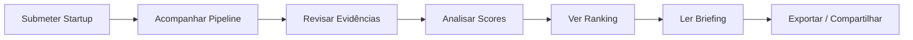

# User Workflow

> Fluxo completo de uso do NVIDIA Startup AI Radar, do input ao brief.

---

## Visão Geral



---

## Passo 1 — Submeter Startup

**O que o usuário faz:**

Fornece o nome da startup e, opcionalmente:
- Vertical de atuação (HealthTech, FinTech, AgTech, LegalTech, EdTech)
- URL(s) conhecida(s) da startup
- Contexto adicional (ex.: "recebeu série A em 2025")

**Input example:**

```bash
python -m radar.analyze --startup "StartupX" --vertical "HealthTech"
```

**O que o sistema faz:**

1. Search Planner define objetivos de coleta com base no input
2. Identifica fontes-alvo (website oficial, blog, LinkedIn, imprensa)
3. Dispara a pipeline de coleta e extração

**Tempo estimado:** 10 segundos para entrada.

---

## Passo 2 — Acompanhar Pipeline

**O que o usuário vê:** Status em tempo real da pipeline.

| Estágio | Status | Descrição |
|---|---|---|
| Search Planning | ✅ Concluído | Objetivos de coleta definidos |
| Source Search | ✅ Concluído | 8 fontes encontradas (3 nível 1, 4 nível 2, 1 nível 3) |
| Extraction | ✅ Concluído | 12 evidências extraídas |
| Classification | ✅ Concluído | Nível 3 — AI-native |
| Evidence Validation | ✅ Concluído | 8 fatos, 3 inferências, 1 hipótese |
| Production AI Readiness | Concluído | Perfil: MADURO |
| Dual Scoring | ⏳ Processando | Defensibility + Inception Fit |
| Ranking | ⏳ Aguardando | |
| Recommendation | ⏳ Aguardando | |
| Briefing | ⏳ Aguardando | |

**O que o usuário faz:** Acompanha visualmente, pode interromper se algo parece errado (em versão futura com human-in-the-loop).

**Tempo estimado:** 30-60 segundos para pipeline completa.

---

## Passo 3 — Revisar Evidências

**O que o usuário vê:** Lista de evidências coletadas, organizadas por tipo e confiança.

```
EVIDÊNCIAS COLETADAS: StartupX

## Fatos (8)
1. [website oficial] Fundada em 2021 por João Silva e Maria Santos
   └─ Fonte: https://startupx.com/sobre | Nível 1 | 2026-01-15
2. [blog] Modelo proprietário de NLP treinado em 50M documentos jurídicos
   └─ Fonte: https://blog.startupx.com/nlp-model | Nível 1 | 2026-02-01

## Inferências (3)
1. Stack de IA inclui PyTorch e transformers (deduzido de vagas + posts)
   └─ Fonte: https://linkedin.com/company/startupx/jobs | Nível 2 | 2026-01-20

## Hipóteses (1)
1. Pode estar avaliando migração para GPU (baseado em crescimento de req)
   └─ Fonte: https://startupx.com/casos-de-uso | Nível 3 | 2026-03-01
```

**O que o usuário faz:**
- ✅ Confirma evidências como válidas
- ❌ Marca evidência como duvidosa (sinaliza para revisão)
- 🔍 Abre URL para verificar diretamente
- 🏷️ Altera classificação fato/inferência/hipótese manualmente

**Critério de qualidade:** Cada fato tem URL, nível de fonte, data de acesso.

---

## Passo 4 — Analisar Scores

**O que o usuário vê:** Painel do Dual Scoring Engine.

```
┌────────────────────────────────────────────────────────────┐
│                    DUAL SCORING ENGINE                      │
├────────────────────────┬───────────────────────────────────┤
│ AI-Native Defensibility│ NVIDIA Inception Fit              │
│       72/100           │       68/100                      │
├────────────────────────┴───────────────────────────────────┤
│ Composto: 70/100 (α=0.6 Defensibility + β=0.4 Fit)        │
│ Modo: Quality                                            │
│ Confidence: Alta (82%)                                    │
└────────────────────────────────────────────────────────────┘
```

**Detalhamento por dimensão:**

| Dimensão | Score | Peso | Status |
|---|---|---|---|
| Dependência IA no core | 85 | 25% | 🟢 |
| Dados proprietários | 70 | 20% | 🟡 |
| Integração workflow | 60 | 15% | 🟡 |
| Aprendizado acumulado | 75 | 15% | 🟢 |
| Complexidade replicação | 65 | 15% | 🟡 |
| Potencial aceleração NVIDIA | 80 | 10% | 🟢 |

**Production AI Readiness:**

| Critério | Status | Detalhe |
|---|---|---|
| Observability | ✅ | Logs de inferência em produção |
| Deployment pipeline | ✅ | CI/CD para modelos |
| Model governance | ✅ | Versionamento e testes |
| Quality evaluation | ✅ | Métricas offline e online |
| Scalability | ⚠️ | Arquitetura horizontal parcial |
| Security & compliance | ✅ | LGPD implementado |

**O que o usuário faz:**
- Altera pesos α/β conforme contexto (hunter vs quality)
- Clica em dimensão para ver evidências que a suportam
- Compara com scores de outras startups analisadas

---

## Passo 5 — Ver Ranking

**O que o usuário vê:** Posição da startup no ranking.

```
RANKING ATUAL (12 startups analisadas)

# │ Startup              │ Score  │ Confiança │ Def. │ Fit  │ Vertical
──┼──────────────────────┼────────┼───────────┼──────┼──────┼────────────
1 │ StartupY             │ 85     │ 🟢 Alta   │ 88   │ 82   │ HealthTech
2 │ StartupZ             │ 78     │ 🟢 Alta   │ 82   │ 74   │ FinTech
3 │ StartupX             │ 72     │ 🟢 Alta   │ 78   │ 65   │ HealthTech ←
4 │ StartupW             │ 58     │ 🟡 Média  │ 60   │ 55   │ AgTech
5 │ StartupV             │ 45     │ 🔴 Baixa  │ 50   │ 38   │ LegalTech
```

**O que o usuário faz:**
- Filtra por vertical, confiança mínima, score mínimo
- Reordena por Defensibility ou Inception Fit individualmente
- Identifica startups com alta confiança e alto score como prioridade
- Startups com baixa confiança são sinalizadas para coleta adicional

---

## Passo 6 — Ler Startup Action Brief

**O que o usuário vê:** Briefing executivo completo.

→ Ver template completo em `16_briefing_template.md` e exemplo no Ato 9 de `08_demo_script.md`.

**Seções do brief:**
1. Startup summary + Score Card
2. Classificação AI-native com evidências
3. Production AI Readiness
4. Technical gaps identificados
5. NVIDIA recommendations com justificativa técnica
6. **Suggested Technical Experiment** (diferencial)
7. Próxima ação sugerida
8. Evidências com URLs e confiança

**O que o usuário faz:**
- Lê o brief em ≤2 minutos
- Decide próxima ação comercial/técnica
- Compartilha com time ou startup

---

## Passo 7 — Exportar / Compartilhar

**Formatos de saída:**

| Formato | Uso |
|---|---|
| Markdown | Leitura, documentação, compartilhamento interno |
| JSON | Integração com sistemas, API, automação |
| CLI stdout | Visualização direta no terminal |

**O que o usuário faz:**
- Exporta como markdown para anexar em email ou documento
- Exporta como JSON para integrar com CRM ou dashboard

---

## Casos de Uso Adicionais

| Caso | Fluxo |
|---|---|
| **Reanálise** | Submeter mesma startup com novas fontes → pipeline reaproveita evidências existentes |
| **Comparação** | Submeter múltiplas startups → ranking consolidado (futuro) |
| **Alerta de mudança** | Reanalisar startup após 90 dias → comparar scores e detectar evolução |

---

## Tempo Total do Workflow

| Passo | Tempo estimado |
|---|---|
| 1. Submeter | 10s |
| 2. Pipeline | 30-60s (automático) |
| 3. Revisar evidências | 1-2 min |
| 4. Analisar scores | 30s |
| 5. Ver ranking | 15s |
| 6. Ler briefing | 1-2 min |
| 7. Exportar | 10s |
| **Total** | **3-6 min** |
