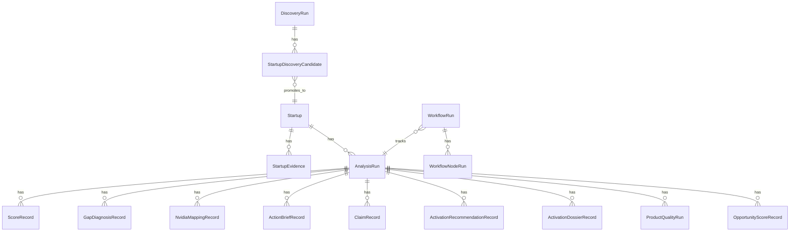

# API, Contratos e Modelo de Dados

## Objetivo

Este documento descreve os contratos externos da API, os objetos persistidos e o fluxo correto para operar o produto como ranking global de startups.

## App FastAPI

Arquivo principal:

```text
src/api/main.py
```

Configuração:

```text
FastAPI title: NVIDIA Startup AI Radar API
CORS: bloqueia wildcard em APP_MODE=product
lifespan: initialize_product_database()
metrics: GET /metrics se prometheus_client estiver disponível
```

Routers:

```text
src/api/product_routes.py
src/api/workflow_routes.py
```

## Health e readiness

| Método | Rota | Uso |
|---|---|---|
| GET | `/health/product` | health lógico do produto |
| GET | `/health/dependencies` | dependências externas |
| GET | `/product/capabilities` | capacidades e status |
| GET | `/product/configuration` | configuração observada |
| GET | `/product/setup-checklist` | checklist de setup |
| GET | `/product/readiness` | readiness agregado |
| GET | `/product/quality-report` | relatório agregado de qualidade |
| GET | `/workflows/langgraph-status` | disponibilidade LangGraph |

Rotas mutáveis críticas usam `ReadinessGate`.

## Startups

| Método | Rota | Descrição |
|---|---|---|
| POST | `/startups` | cria startup manualmente |
| GET | `/startups` | lista startups |
| GET | `/startups/{startup_id}` | detalhe com evidências |
| PATCH | `/startups/{startup_id}` | atualiza startup |

Objeto `Startup`:

```text
id
name
normalized_name
website
country
sector
description
product_summary
status
tags
evidence[]
created_at
updated_at
```

## Discovery

| Método | Rota | Descrição |
|---|---|---|
| GET | `/discovery/sources` | lista fontes configuradas |
| POST | `/discovery/manual-seed` | cria candidates a partir de seed estruturada |
| POST | `/discovery/url-list` | cria candidates a partir de URLs |
| POST | `/discovery/run-source-scraper` | roda scraper de fonte cadastrada |
| GET | `/discovery/runs` | lista runs de discovery |
| GET | `/discovery/runs/{run_id}` | detalhe do run |
| GET | `/discovery/candidates` | lista candidatos filtráveis |
| GET | `/discovery/candidates/{candidate_id}` | detalhe de candidato |
| POST | `/discovery/candidates/{candidate_id}/promote` | promove candidato para startup |
| POST | `/discovery/candidates/{candidate_id}/dedup` | verifica duplicidade |

Filtros de candidatos:

```text
status
source_id
sector
confidence_min
has_website
ai_native_signal
offset
limit
```

## Workflow

| Método | Rota | Descrição |
|---|---|---|
| POST | `/workflows/product-runs` | cria e executa workflow LangGraph |
| GET | `/workflows/product-runs` | lista workflows |
| GET | `/workflows/product-runs/{workflow_id}` | detalhe do workflow |
| GET | `/workflows/product-runs/{workflow_id}/nodes` | node runs |
| GET | `/analysis-runs/{analysis_run_id}/workflow` | workflow por análise |
| GET | `/workflows/{workflow_id}/review-payload` | payload de revisão |
| POST | `/workflows/{workflow_id}/review` | submete decisão de revisão |
| POST | `/workflows/{workflow_id}/resume` | retoma workflow interrompido |

Payload mínimo de criação:

```json
{
  "startup_id": "uuid-ou-null",
  "discovery_candidate_id": "uuid-ou-null",
  "use_rag": true
}
```

Regra: informe `startup_id` ou `discovery_candidate_id`. Em produto, `use_rag` deve ser verdadeiro.

## Analysis runs

| Método | Rota | Descrição |
|---|---|---|
| POST | `/analysis-runs` | compatibilidade para iniciar workflow de análise |
| POST | `/startups/{startup_id}/analysis-runs` | cria analysis run direto |
| GET | `/analysis-runs/{analysis_run_id}` | detalhe completo |
| POST | `/analysis-runs/{analysis_run_id}/review` | revisão por análise |
| POST | `/analysis-runs/{analysis_run_id}/resume` | retoma análise |
| GET | `/analysis-runs/{analysis_run_id}/reviews` | revisões |

`AnalysisRun` agrega:

```text
scores
gaps
nvidia_mappings
readiness_checks
action_brief_id
input_snapshot
output_snapshot
pipeline_version
corpus_version
status/error/degraded_reason
```

## Brief, claims, evidência e dossier

| Método | Rota | Descrição |
|---|---|---|
| GET | `/analysis-runs/{analysis_run_id}/brief` | action brief persistido |
| GET | `/analysis-runs/{analysis_run_id}/brief/export/json` | export JSON do brief |
| GET | `/analysis-runs/{analysis_run_id}/claims` | claims gerados |
| PATCH | `/analysis-runs/{analysis_run_id}/claims/{claim_id}/review` | revisão de claim |
| GET | `/analysis-runs/{analysis_run_id}/evidence-coverage` | cobertura de evidência |
| GET | `/analysis-runs/{analysis_run_id}/evidence-bundle` | bundle de evidência |
| GET | `/activation-playbooks` | playbooks disponíveis |
| GET | `/analysis-runs/{analysis_run_id}/activation-recommendations` | recomendações de ativação |
| POST | `/analysis-runs/{analysis_run_id}/activation-recommendations/generate` | gera recomendações |
| POST | `/analysis-runs/{analysis_run_id}/dossier` | gera dossier |
| GET | `/analysis-runs/{analysis_run_id}/dossier` | lê dossier |
| GET | `/analysis-runs/{analysis_run_id}/dossier/markdown` | dossier markdown |

## Quality

| Método | Rota | Descrição |
|---|---|---|
| POST | `/analysis-runs/{analysis_run_id}/quality-runs` | executa avaliação de qualidade |
| GET | `/analysis-runs/{analysis_run_id}/quality-runs` | lista avaliações |
| GET | `/analysis-runs/{analysis_run_id}/quality-runs/latest` | última avaliação |
| GET | `/analysis-runs/{analysis_run_id}/quality-summary` | resumo agregado |

## Opportunities e ranking global

| Método | Rota | Descrição |
|---|---|---|
| GET | `/opportunities` | lista oportunidades a partir de latest analysis por startup |
| POST | `/analysis-runs/{analysis_run_id}/opportunity-score` | calcula score global da análise |
| GET | `/analysis-runs/{analysis_run_id}/opportunity-score` | lê score global |
| GET | `/opportunities/ranked` | lista final ranqueada de startups/análises |

Filtros de `/opportunities`:

```text
status
recommended_motion
min_score
sector
has_degraded
review_decision
order_by
offset
limit
```

Filtros de `/opportunities/ranked`:

```text
min_score
tier
recommended_action
offset
limit
```

Contrato de produto: `/opportunities/ranked` deve ser a fonte da tela final que mostra todas as startups com scores.

## Exports

| Método | Rota | Descrição |
|---|---|---|
| POST | `/analysis-runs/{analysis_run_id}/exports` | cria export |
| GET | `/exports/{export_id}` | lê export |

Exports devem ser gerados a partir de runs persistidos, não de estado mockado.

## Modelo relacional principal



## Estados recomendados

Startup:

```text
active
inactive
archived
```

Candidate:

```text
new
promoted
duplicate
rejected
```

Analysis/Workflow:

```text
queued
running
awaiting_review
completed
degraded
failed
cancelled
```

Quality:

```text
pass
warn
fail
```

## Sequência mínima para ranking

```text
POST /discovery/manual-seed
GET /discovery/candidates
POST /discovery/candidates/{candidate_id}/promote
POST /workflows/product-runs
GET /workflows/product-runs/{workflow_id}/nodes
POST /analysis-runs/{analysis_run_id}/opportunity-score
GET /opportunities/ranked
```

## Contratos de erro

Padrões esperados:

```text
404 quando recurso não existe
409 quando promoção/dedup conflita
422 para schema inválido
failed workflow com error_message persistido para falha de nó crítico
awaiting_review quando o grafo interrompe para revisão humana
```

## Critérios de integração da UI

1. Não hardcodar startup, analysis run ou candidate.
2. Usar `/product/readiness` para bloquear ações se setup estiver incompleto.
3. Usar `/discovery/candidates` para fila de candidatos.
4. Usar `/workflows/product-runs/{id}/nodes` para progresso real.
5. Usar `/opportunities/ranked` como lista final ranqueada.
6. Usar `/analysis-runs/{id}/evidence-bundle`, `/claims` e `/quality-summary` para auditoria.
