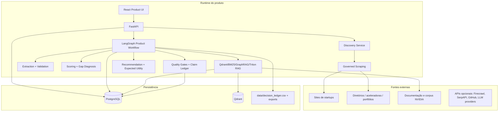
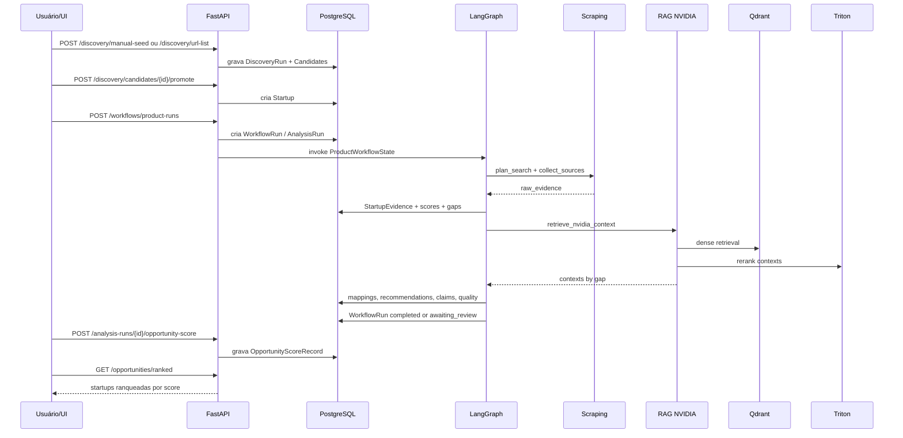

# Arquitetura Completa do Projeto

## 1. Visão geral

O NVIDIA Startup AI Radar é um sistema de inteligência técnica para descobrir, analisar e ranquear startups AI-native brasileiras com base em evidências públicas e recomendações NVIDIA. A arquitetura foi desenhada para três propriedades centrais:

1. **Rastreabilidade:** cada score, recomendação e claim deve apontar para evidência, contexto RAG ou decisão calibrada.
2. **Fail-closed em produção:** dependências críticas ausentes bloqueiam a execução em `APP_MODE=product`.
3. **Ranking global:** o output de produto é uma lista de oportunidades ordenadas, não uma análise isolada fixa.

## 2. Fronteiras do sistema



## 3. Estrutura de diretórios relevante

```text
src/api/                  FastAPI routers, schemas e health/readiness endpoints
src/orchestration/        LangGraph graph, runner, state e node implementations
src/database/             SQLAlchemy models e sessão de banco
src/repositories/         Repositórios transacionais por agregado
src/services/product/     Serviços de produto: readiness, dossier, export, claims, score
src/discovery/            Descoberta de candidatos e deduplicação
src/scraping/             Collectors governados e scrapers específicos
src/extraction/           Schemas e extração de perfil/evidência
src/classification/       Classificação AI-native e maturidade técnica
src/diagnosis/            Diagnóstico de gaps técnicos e mapeamento para taxonomia
src/rag/                  Corpus, retrieval, Qdrant, GraphRAG, reranking e técnicas
src/recommendation/       Mapeamento NVIDIA e enriquecimento de próxima ação
src/decisioning/          Scoring probabilístico, calibration, expected utility, ledger
src/quality/              Quality gates e avaliadores de saída
src/briefing/             Geração de action brief e renderização markdown
frontend/src/             React UI, componentes e client API
config/                   Parâmetros calibrados e políticas YAML
scripts/                  Operação, validação, ingestão e release
```

## 4. Componentes principais

### 4.1 Frontend

O frontend em `frontend/` é uma SPA React/Vite. Componentes relevantes:

| Componente | Função |
|---|---|
| `DiscoveryView` | listar fontes, rodar discovery, ver candidatos |
| `StartupListView` | listar startups persistidas |
| `StartupDetailPanel` | detalhe e início de análise |
| `WorkflowView` | criação/acompanhamento de workflow |
| `WorkflowNodeTimeline` | timeline de nós, status e retries |
| `OpportunitiesView` | lista de oportunidades e ranking |
| `HumanReviewView` | revisão humana e retomada |
| `DossierView` | visualização do dossier de ativação |
| `QualitySummaryPanel` | qualidade e readiness |
| `ExportDeliveryView` | export da análise/brief |

A UI deve depender de dados reais da API. Rotas mockadas ou fixtures não devem ser usadas como caminho de entrega.

### 4.2 API

`src/api/main.py` cria o app FastAPI, inicializa banco no lifespan, configura CORS e expõe `/metrics`.

Routers:

| Router | Arquivo | Escopo |
|---|---|---|
| Product | `src/api/product_routes.py` | startups, analyses, discovery, opportunities, dossiers, exports, quality |
| Workflow | `src/api/workflow_routes.py` | workflow LangGraph, node timeline, review, resume |

### 4.3 Banco transacional

O banco é o sistema de registro. Em produção, use PostgreSQL; SQLite ou memória não devem ser aceitos como validação final. O modelo usa UUIDs string, timestamps timezone-aware e campos JSON para snapshots auditáveis.

Entidades de maior criticidade:

```text
Startup → AnalysisRun → ScoreRecord / GapDiagnosisRecord / NvidiaMappingRecord
AnalysisRun → ClaimRecord / ActionBriefRecord / ActivationDossierRecord / ProductQualityRun
WorkflowRun → WorkflowNodeRun
DiscoveryRun → StartupDiscoveryCandidate → Startup
AnalysisRun → OpportunityScoreRecord → GET /opportunities/ranked
```

### 4.4 LangGraph runtime

O workflow é compilado por `build_workflow_graph()` e executado por `WorkflowRunner`. Em `APP_MODE=product`, o runner exige checkpointer persistente Postgres. O estado compartilhado é `ProductWorkflowState`.

O grafo registra cada nó em `workflow_node_runs` com:

```text
workflow_run_id
node_name
status
input_snapshot_json
output_snapshot_json
error_message
retry_count
metadata_json
```

### 4.5 Discovery

`StartupDiscoveryService` cria candidatos usando três fontes de entrada:

1. **Manual seed**: lista estruturada de startups.
2. **URL list**: páginas informadas pelo usuário.
3. **Source scraper**: fonte cadastrada em `src/config/discovery_sources.json`.

O serviço normaliza nomes, detecta sinais AI-native, calcula confiança, deduplica por nome/domínio e grava `StartupDiscoveryCandidate`.

### 4.6 Scraping governado

A camada de scraping não deve fazer requisições arbitrárias fora dos collectors governados. O contrato mínimo inclui:

```text
robots/terms awareness
rate limit por domínio
cache / ETag / Last-Modified quando aplicável
retry e circuit breaker
deduplicação fuzzy
extração de texto principal
source quality prior
métricas de erro e cobertura
```

Gates de produção vêm do ambiente e de `config/source_quality.yaml`.

### 4.7 RAG NVIDIA

O RAG oficial é construído em `src/rag/rag_service_factory.py::QdrantRagService` e usa o modo:

```text
bm25_graphrag_qdrant_triton_rerank
```

Caminho por gap:

```text
GapDiagnosisResultItem
→ query generation
→ BM25 lexical retrieval over ChunkIndex
→ dense retrieval in Qdrant
→ local reranking / provenance reranking
→ GraphRAG expansion
→ Triton HTTP v2 reranking
→ context filtering by calibrated relevance threshold
→ citation-ready contexts
```

Produção bloqueia se Qdrant, corpus, embedding model, BM25, GraphRAG ou Triton reranker estiverem ausentes.

### 4.8 Recomendação e decisão

O motor transforma gaps e contextos RAG em recomendações NVIDIA. O ranking é em duas etapas:

1. `rank_recommendations`: ordenação por prioridade técnica, confiança, suporte e maturidade.
2. `rank_with_expected_utility`: ordenação por utilidade esperada, penalizando risco, incerteza e complexidade.

`OpportunityScoreService` calcula o score global da startup/análise, usado por `GET /opportunities/ranked`.

### 4.9 Qualidade, claims e ledger

A qualidade é aplicada em três camadas:

1. **Quality gates durante workflow:** bloqueiam outputs sem evidência mínima.
2. **Claim ledger:** cada claim tem tipo, texto, evidência, suporte e status de revisão.
3. **Decision ledger:** arquivo `data/decision_ledger.csv` registra decisões de scoring e ranking com métricas, alternativas, riscos, confiança e incerteza.

## 5. Fluxo de dados fim-a-fim



## 6. Estado do workflow

Campos de maior importância em `ProductWorkflowState`:

| Campo | Origem | Uso |
|---|---|---|
| `startup_id` / `discovery_candidate_id` | request | define entidade analisada |
| `analysis_run_id` | runner/repository | chave de persistência da análise |
| `search_plan` | `plan_search` | fontes e consultas planejadas |
| `raw_evidence` | `collect_sources` | conteúdo bruto coletado |
| `evidence_items` | `validate_evidence` | evidência aceita e normalizada |
| `startup_profile` | `extract_profile` | perfil estruturado da startup |
| `classification_result` | `score_startup_probabilistic` | classe AI-native e confiança |
| `scores` / `evidence_weighted_scores` | scoring | score, confiança e incerteza |
| `gap_ids` | `diagnose_gaps` | gaps ativos |
| `nvidia_contexts` | RAG | contextos técnicos NVIDIA |
| `technique_results` | technique runner | resultados de técnicas híbridas |
| `nvidia_mappings` | mapping | tecnologia por gap |
| `ranked_recommendations` | expected utility | recomendações finais ordenadas |
| `brief` | briefing | action brief estruturado |
| `claim_ids` | claim ledger | claims auditáveis |
| `dossier_id` | activation dossier | documento final de ativação |
| `quality_run_id` | quality | métricas e status final |
| `review_payload` | human review | payload de interrupção |
| `decision_ledger_path` | ledger | caminho do CSV de decisão |

## 7. Políticas de falha

### 7.1 Fail-closed

Em produto, nó crítico não pode retornar `FAILED`, `DEGRADED` ou `SKIPPED`. Exemplos de falha bloqueante:

```text
RAG desabilitado
Qdrant inacessível
Triton reranker sem URL
corpus vazio
config YAML inválida
sem evidência mínima
sem gap diagnosticado
sem recomendação ranqueável
quality gates com blocker crítico
```

### 7.2 Retry

`WORKFLOW_NODE_MAX_RETRIES` limita novas tentativas por nó. O default é `2`, com clamp entre `0` e `5`. Retries são registrados no `WorkflowNodeRun`.

### 7.3 Human-in-the-loop

O nó `needs_review` é não crítico e pode interromper o grafo usando LangGraph interrupt. O estado fica `awaiting_review`, e a retomada ocorre por:

```text
POST /workflows/{workflow_id}/resume
```

A revisão deve gerar `ReviewDecision` e preservar payload/snapshot.

## 8. Segurança e governança

Controles já representados no projeto:

```text
CORS sem wildcard em APP_MODE=product
segredos via .env, nunca hardcoded
scans: detect-secrets, pip-audit, bandit, OpenSSF scorecard
source registry para fontes públicas
calibration registry para decisões quantitativas
claim/evidence ledger para rastreabilidade
readiness gate antes de rotas mutáveis críticas
```

## 9. Observabilidade

O sistema expõe `/metrics` se `prometheus_client` estiver disponível. Métricas por nó são observadas via `src/observability/metrics.py` e node runs persistem snapshots completos para auditoria.

Sinais operacionais mínimos:

```text
workflow status
current_node
node retry_count
failed_nodes
degraded_nodes
rag_retrieval_status
retrieved_context_count
citation_ready_context_count
quality overall_status
opportunity_score tier
```

## 10. Arquitetura de implantação

### Desenvolvimento

```text
FastAPI local + Vite local + PostgreSQL Docker + Qdrant Docker
Triton pode ser omitido apenas para testes que não validam produção
```

### Produção/entrega final

```text
APP_MODE=product
PostgreSQL persistente
LangGraph Postgres checkpointer
Qdrant com corpus NVIDIA ingestado
Triton reranker configurado
CORS_ALLOWED_ORIGINS explícito
sem mocks ou fallbacks silenciosos em runtime crítico
```


## 11. Tecnologias e técnicas no encaixe arquitetural

A arquitetura combina tecnologias de infraestrutura com técnicas de decisão/RAG. A tabela abaixo explicita o encaixe de cada grupo no fluxo fim-a-fim. Detalhes completos estão em `docs/TECNOLOGIAS_E_TECNICAS.md`.

| Grupo | Técnica/tecnologia | Ponto da arquitetura | Como impacta o output |
|---|---|---|---|
| API | FastAPI, Pydantic | borda HTTP e schemas | transforma ações da UI em comandos validados e respostas tipadas |
| Persistência | PostgreSQL, SQLAlchemy, Alembic | banco transacional | mantém histórico auditável de startups, evidências, scores, claims, dossiers e ranking |
| Orquestração | LangGraph, PostgresSaver | workflow runtime | garante execução única, estado serializado, retries, checkpoints e human-in-the-loop |
| Discovery | source registry, dedup fuzzy, scraping governado | entrada de candidatos e evidências | permite analisar múltiplas startups sem seleção manual fixa |
| Parsing | trafilatura, BeautifulSoup/selectolax/readability, PyMuPDF/MarkItDown, Playwright/Crawl4AI opcionais | coleta e normalização de conteúdo | transforma fontes públicas em texto rastreável e evidência estruturada |
| Classificação | heurística AI-native + Naive Bayes local opcional | `score_startup_probabilistic` | define maturidade AI-native, confiança, incerteza e missing evidence |
| Diagnóstico | gap taxonomy | `diagnose_gaps` | identifica quais problemas técnicos justificam recomendação NVIDIA |
| RAG lexical | BM25/Okapi | `retrieve_nvidia_context` | recupera docs por termos exatos e nomes de tecnologias |
| RAG semântico | BAAI/bge-m3 + Qdrant | `retrieve_nvidia_context` | recupera docs relevantes por similaridade semântica |
| RAG relacional | GraphRAG | `retrieve_nvidia_context` | expande contexto por entidade, produto, fonte e gap |
| Reranking | NVIDIA Triton HTTP v2 | `retrieve_nvidia_context` | reordena contextos por aderência query-contexto e bloqueia produção se ausente |
| Técnica híbrida | `config/techniques.yaml` + `technique_runner` | `enhance_contexts_with_techniques` | aplica retrieval, reranking, post-processing e reflection antes do mapping |
| Decisão | evidence-weighted scoring, expected utility | `rank_recommendations`, `rank_with_expected_utility` | ordena recomendações por valor, evidência, risco, complexidade e incerteza |
| Ranking global | OpportunityScoreService | `/opportunities/ranked` | converte análise individual em ranking comparável entre startups |
| Governança | claim ledger, quality gates, readiness gate | final do workflow e rotas críticas | impede entrega com claims sem suporte, dados incompletos ou dependências ausentes |

### Como o RAG híbrido se encaixa tecnicamente

O RAG não é uma chamada isolada. Para cada gap, o sistema:

```text
gap técnico
→ query com termos do gap e tecnologias NVIDIA candidatas
→ BM25 no ChunkIndex local
→ embedding BAAI/bge-m3
→ busca vetorial no Qdrant
→ fusão híbrida / reranking local
→ expansão GraphRAG por entidades/fonte/produto/gap
→ reranking NVIDIA Triton
→ filtro por relevance threshold
→ contexto citation-ready para mapping e claims
```

### Como as técnicas de decisão se encaixam

O ranking não é apenas ordenação por fit. A decisão final combina:

```text
score ponderado por evidência
+ confiança
+ diversidade de fontes
+ suporte RAG
+ resolução de gaps
+ utilidade esperada
- risco
- complexidade
- incerteza
- penalidades por claims fracos/degradação/dados incompletos
```

Isso faz o produto priorizar startups que sejam simultaneamente AI-native, tecnicamente ativáveis pela NVIDIA, bem evidenciadas e prontas para uma próxima ação comercial/técnica.

## 12. Extensões futuras seguras

| Extensão | Ponto correto |
|---|---|
| nova fonte de discovery | `src/config/discovery_sources.json` + scraper/collector governado |
| nova tecnologia NVIDIA | corpus + `nvidia_technology_mapping` + testes de mapping |
| nova métrica de ranking | `OpportunityScoreService` ou `expected_utility_ranker` |
| nova técnica RAG | `config/techniques.yaml` + `src/rag/technique_registry.py` |
| novo quality gate | `src/quality/evaluators/` + threshold em `config/eval_thresholds.yaml` |
| novo export | `src/services/product/export_service.py` |

## 13. Critérios arquiteturais de aceite

A arquitetura está coerente quando:

1. `POST /workflows/product-runs` executa a pipeline única.
2. O workflow grava `WorkflowRun` e `WorkflowNodeRun` reais.
3. Nenhum nó crítico passa degradado em `APP_MODE=product`.
4. RAG retorna `retrieval_mode=bm25_graphrag_qdrant_triton_rerank`.
5. Cada recomendação possui suporte por evidência ou contexto RAG.
6. `OpportunityScoreRecord` existe para análises concluídas.
7. `GET /opportunities/ranked` retorna lista ordenada, filtrável e não hardcoded.
8. Claims, quality summary, dossier e decision ledger são gerados.
