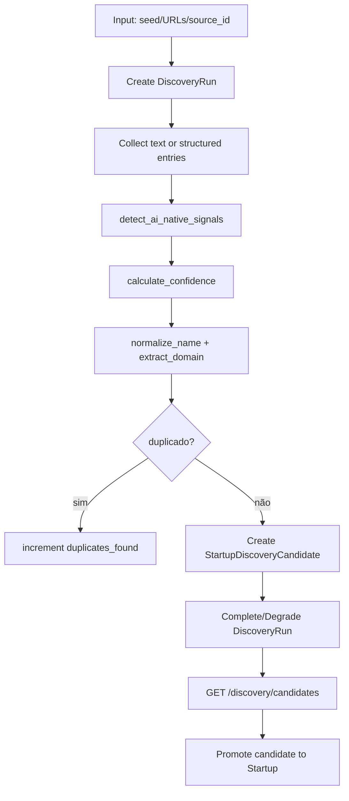

# Pipeline de Scraping e Descoberta

## Objetivo

A pipeline de scraping/descoberta coleta evidências públicas sobre startups brasileiras com potencial AI-native. Ela alimenta o perfil estruturado, a validação de evidência, o scoring probabilístico, o diagnóstico de gaps e o ranking final de oportunidades.

O sistema deve operar em lote sobre múltiplas startups/candidatas. O output final do produto depende de várias análises persistidas e do ranking global em `/opportunities/ranked`.

## Entradas de discovery

| Entrada | Endpoint | Serviço |
|---|---|---|
| Manual seed | `POST /discovery/manual-seed` | `run_manual_seed_discovery()` |
| Lista de URLs | `POST /discovery/url-list` | `run_url_list_discovery()` |
| Source scraper | `POST /discovery/run-source-scraper` | `run_source_scraper_discovery()` |
| Fontes disponíveis | `GET /discovery/sources` | `list_sources()` |

## Modelo de dados

```text
DiscoveryRun
  └── StartupDiscoveryCandidate
          └── promoted_startup_id → Startup
```

Campos críticos do candidato:

```text
discovered_name
normalized_name
website
country
sector
description
source_url
raw_text_excerpt
ai_native_signals_json
evidence_refs_json
confidence
status
promoted_startup_id
metadata_json
```

## Source registry

Fontes de discovery ficam em:

```text
src/config/discovery_sources.json
```

Cada fonte define:

```text
source_id
name
source_type
base_url
country_scope
sector_scope
allowed
requires_api_key
rate_limit_hint
collection_method
robots_or_terms_note
enabled_by_default
notes
```

Uma fonte só é considerada usável quando `allowed=true`, termos/robots estão endereçados e dependências de API key estão satisfeitas.

## Fluxo de descoberta



## Deduplicação

O serviço deduplica por:

```text
normalized_name
similaridade fuzzy do nome
domínio do website
startup já promovida
candidate já existente
```

Endpoints:

```text
GET  /discovery/candidates/{candidate_id}
POST /discovery/candidates/{candidate_id}/dedup
POST /discovery/candidates/{candidate_id}/promote
```

## Planejamento de coleta dentro do workflow

No grafo principal:

```text
plan_search → collect_sources → extract_profile → validate_evidence
```

`plan_search` deve produzir um plano com:

```text
startup name
website
sector/product hints
fontes oficiais
fontes independentes
queries por lacuna de informação
prioridade e custo esperado da fonte
expected_information_gain
```

`collect_sources` executa o plano e preenche `raw_evidence`.

## Scraping governado

A coleta em produção deve passar por collectors governados em `src/scraping/`, não por HTTP arbitrário. O contrato técnico mínimo:

| Requisito | Motivo |
|---|---|
| robots/terms awareness | compliance de fonte pública |
| rate limit por domínio | evitar abuso e bloqueios |
| cache | reduzir chamadas e estabilizar resultados |
| retry com backoff | resiliência contra falhas transitórias |
| circuit breaker | evitar insistência em fonte quebrada |
| dedup fuzzy | reduzir evidência repetida |
| content quality | filtrar páginas vazias/ruído |
| parser/extractor | manter apenas texto útil |
| source quality prior | pesar confiabilidade da fonte |
| métricas | auditar cobertura e erro |

Módulos relevantes:

```text
src/scraping/http_collector.py
src/scraping/fetcher.py
src/scraping/cache.py
src/scraping/domain_rate_limiter.py
src/scraping/circuit_breaker.py
src/scraping/content_quality.py
src/scraping/parser.py
src/scraping/fuzzy_dedup.py
src/scraping/source_registry.py
src/scraping/source_policy.py
```

## Gates quantitativos

Variáveis de ambiente principais:

```text
SCRAPING_MIN_RAW_EVIDENCE=5
SCRAPING_MIN_DISTINCT_SOURCES=3
SCRAPING_MIN_SOURCE_CATEGORIES=2
SCRAPING_MIN_OFFICIAL_SOURCES=1
SCRAPING_MAX_ERROR_RATE=0.25
```

Critérios esperados antes de seguir para scoring:

```text
mínimo de evidências brutas
mínimo de fontes distintas
cobertura por categorias de fonte
pelo menos uma fonte oficial quando possível
taxa de erro abaixo do limite
sem duplicação excessiva
```

## Evidência aceita

Cada item de evidência deve preservar:

```text
id/source_id
source_url
source_type/source_category
title
claim ou text/snippet
quote_or_evidence
confidence
evidence_kind
collected_at
source_quality_prior
authority_weight
marginal_utility
metadata_json
```

## Integração com extração e validação

`extract_profile` transforma evidências em `startup_profile`:

```text
name
website
country
sector
description
product_summary
technical_keywords
AI-native signals
maturity/readiness hints
```

`validate_evidence` deve separar evidência aceita, fraca, duplicada ou insuficiente. A saída alimenta scoring e claim ledger.

## Modos degradados

Em desenvolvimento, algumas fontes podem falhar e retornar estado degradado. Em `APP_MODE=product`, degradação em coleta/validação é bloqueante porque o grafo marca esses nós como críticos.

## Output esperado para ranking global

Para uma operação completa de discovery até ranking:

```text
DiscoveryRun completed/degraded com métricas
StartupDiscoveryCandidate com confidence e status
Startup promovida
WorkflowRun por startup/candidate
AnalysisRun com evidências, scores, gaps e recomendações
OpportunityScoreRecord por análise
GET /opportunities/ranked com todas as startups analisadas ordenadas
```

## Testes e validação

```bash
pytest -q tests/unit/test_scraper_agent.py
pytest -q tests/unit/test_source_registry.py
pytest -q tests/evals/test_scraping_baseline.py
python scripts/check_source_coverage.py
python scripts/check_source_compliance.py
python scripts/check_evidence_freshness.py
```
