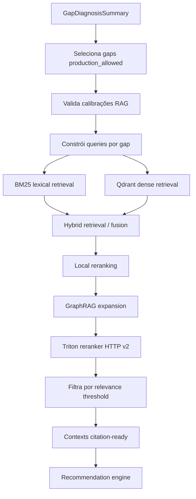

# RAG NVIDIA com BM25, GraphRAG, Qdrant e Triton Reranking

## Objetivo

O RAG NVIDIA fornece o conhecimento técnico usado para transformar gaps da startup em recomendações NVIDIA fundamentadas. Em produção, ele é obrigatório e deve retornar contextos citation-ready.

Modo oficial:

```text
bm25_graphrag_qdrant_triton_rerank
```

## Implementação principal

| Função | Arquivo |
|---|---|
| Factory oficial | `src/rag/rag_service_factory.py` |
| Serviço | `QdrantRagService` |
| Corpus/chunking | `src/rag/ingestion.py` |
| Vector store | `src/rag/qdrant_store.py` |
| Retrieval lexical | `src/rag/sparse_retrieval.py`, `src/rag/retrieval.py` |
| Retrieval híbrido | `src/rag/hybrid_retrieval.py` |
| Reranking local | `src/rag/reranking.py` |
| GraphRAG | `src/rag/graphrag_runtime.py` |
| Triton reranker | `src/rag/triton_reranker.py` |
| Técnicas adicionais | `src/rag/technique_runner.py`, `config/techniques.yaml` |

## Corpus NVIDIA

Diretório:

```text
data/nvidia_corpus/
```

Metadados:

```text
data/nvidia_corpus/sources.yaml
```

Cada source/chunk deve carregar:

```text
source_id
title
url
product / nvidia_technology
gap_types
version
document_type
content_hash
valid_from / valid_until
freshness_policy
stale_after_days
is_active
deprecated_at
superseded_by
corpus_version
chunk_index
char_count
```

## Configuração obrigatória

```text
APP_MODE=product
RAG_REQUIRED_FOR_PRODUCT=true
RAG_VECTOR_BACKEND=qdrant
RAG_RETRIEVAL_MODE=bm25_graphrag_qdrant_triton_rerank
RAG_EMBEDDING_MODEL=BAAI/bge-m3
QDRANT_URL=http://localhost:6333
QDRANT_COLLECTION=nvidia_corpus
QDRANT_VECTOR_SIZE=1024
BM25_ENABLED=true
GRAPHRAG_ENABLED=true
TRITON_RERANKER_ENABLED=true
TRITON_RERANKER_REQUIRED=true
TRITON_RERANKER_URL=http://localhost:8000/v2/models/nvidia-reranker/infer
```

Ingestão:

```bash
python scripts/ingest_nvidia_corpus.py --clear
```

## Pipeline por gap



## Entradas do serviço

`QdrantRagService.__call__()` recebe:

```text
run_id
gap_diagnosis_summary
startup_profile
accepted_evidence_items
claims
ai_native_score
nvidia_fit_score
```

## Saídas do serviço

```text
rag_queries_by_gap
rag_contexts
rag_contexts_by_gap
rag_retrieval_status
rag_retrieval_metrics
rag_metrics
status
review_required
blockers
```

Cada contexto estruturado deve incluir:

```text
context_id
chunk_id
gap_id
gap_types
source_id
nvidia_technology
product
title
snippet
content
url
retrieval_score
rerank_score
relevance_score
retrieval_mode
bm25_active
graphrag_active
graphrag_neighbor
graphrag_metrics
triton_reranker_active
triton_reranker_metadata
citation_ready
retrieved_at
calibration_decision_ids
```

## Calibrações exigidas

`QdrantRagService` valida as decisões abaixo no registry:

```text
rag.semantic_top_k
rag.min_contexts_per_gap
rag.context_relevance_threshold
rag.citation_precision_threshold
rag.unsupported_claim_rate_threshold
rag.hybrid_retrieval_weights
rag.reranker_required
rag.bm25_required
rag.graphrag_required
rag.triton_reranker_required
```

Se uma decisão estiver ausente, bloqueada ou não calibrada, o serviço retorna estado `rag_blocked_uncalibrated`.

## Métricas de retrieval

```text
gap_count
calibrated_gap_count
query_count
retrieved_context_count
context_count_by_gap
gaps_with_min_contexts_count
gaps_without_context_count
average_retrieval_score
average_relevance_score
citation_ready_context_count
missing_rag_calibration_count
reranked_context_count
retrieval_mode
bm25_active
graphrag_active
triton_reranker_required
lexical_corpus_chunk_count
rag_blocker_count
```

## Triton reranker

O reranker envia payload compatível com Triton HTTP v2 `/infer`:

```text
inputs[0].name = TRITON_RERANKER_TEXT_INPUT_NAME, default text_pairs
inputs[0].shape = [N, 2]
inputs[0].datatype = BYTES
inputs[1].name = TRITON_RERANKER_SCORE_INPUT_NAME, default scores
inputs[1].shape = [N]
inputs[1].datatype = FP32
parameters.query = query_text
```

A resposta aceita:

```text
scores: [float]
```

ou:

```text
outputs[0].data: [float]
```

Em `APP_MODE=product`, falha no Triton reranker levanta `TritonRerankerUnavailable` e bloqueia o workflow.

## GraphRAG

GraphRAG expande contextos por relações entre:

```text
chunk
source_id
NVIDIA product
technology entity
gap_type
lineage path source → gap → technology
```

Ele não substitui o retrieval lexical/semântico. Seu papel é aumentar cobertura relacional e reduzir recomendações sem caminho de evidência.

## Technique runner

Após o RAG oficial, o nó `enhance_contexts_with_techniques` aplica grupos de técnicas definidos em `config/techniques.yaml`:

```text
retrieval
reranking
post_processing
reflection
```

Técnicas relevantes incluem:

```text
adaptive_rag
multi_query
fusion_retrieval
bm25
graphrag_runtime
colbert_reranking
cross_encoder
listwise_reranking
triton_reranker
self_rag
source_trust
factual_consistency
uncertainty_estimation
confidence_calibration
structured_outputs
graph_consistency
```


## Como cada técnica de RAG é usada

| Técnica | Papel no pipeline | Como funciona na implementação |
|---|---|---|
| Chunking governado | preparar corpus | Documentos em `data/nvidia_corpus/` viram chunks com `source_id`, `url`, produto NVIDIA, `gap_types`, versionamento e metadados de freshness. |
| BM25 / Okapi | recall lexical | `ChunkIndex` recupera chunks por termos exatos. É essencial para nomes de tecnologias e APIs NVIDIA. |
| Embeddings BAAI/bge-m3 | representação semântica | Corpus e query são convertidos em vetores de 1024 dimensões. |
| Qdrant dense retrieval | recall semântico | Qdrant retorna chunks semanticamente similares à query do gap. |
| Hybrid retrieval | fusão de sinais | Resultados BM25 e Qdrant são combinados para reduzir dependência de uma única estratégia. |
| Reranking local | pré-filtro determinístico | Reordena por aderência ao gap, tecnologia, fonte e proveniência antes do reranker neural. |
| GraphRAG | expansão relacional | Usa entidades, produto, fonte e gap para buscar vizinhos relevantes no corpus. |
| Triton reranker | precisão final | Envia pares `[query, contexto]` para endpoint Triton HTTP v2 e reordena por score retornado. |
| Context filtering | controle de qualidade | Remove contexto abaixo do threshold, deduplica `chunk_id` e exige `source_id`/`url` para citation-ready. |
| Technique runner | pós-processamento governado | Executa técnicas adicionais de retrieval, reranking, post-processing e reflection definidas em `config/techniques.yaml`. |

O ponto central é que cada técnica tem função diferente: BM25 aumenta recall lexical, Qdrant aumenta recall semântico, GraphRAG aumenta cobertura relacional e Triton melhora precisão de ordenação. Nenhuma dessas etapas substitui a validação de evidência; elas fornecem contexto técnico para o motor de recomendação e para o claim ledger.

## Estados de bloqueio

```text
blocked_qdrant_unavailable
blocked_qdrant_corpus_not_ready
blocked_corpus_not_ready
blocked_embedding_provider_unavailable
blocked_uncalibrated_rag
blocked_no_calibrated_gaps
rag_needs_review
rag_failed
```

## Critérios de aceite RAG

1. Qdrant está acessível.
2. Coleção `nvidia_corpus` tem vetores de dimensão `1024`.
3. Corpus local não está vazio.
4. BM25, GraphRAG e Triton estão ativos.
5. Gaps `production_allowed` têm pelo menos `rag.min_contexts_per_gap` contextos.
6. Contextos retornados têm `url`, `source_id` e `citation_ready=true` quando usados em claims/recomendações.
7. `retrieval_mode` é exatamente `bm25_graphrag_qdrant_triton_rerank`.

## Testes e validação

```bash
python scripts/ingest_nvidia_corpus.py --clear
python scripts/check_rag_corpus_coverage.py
python scripts/check_reranker_ready.py
pytest -q tests/unit/test_hybrid_rag.py
pytest -q tests/unit/test_rag_reranking.py
pytest -q tests/unit/test_qdrant_rag_service.py
pytest -q tests/unit/test_graphrag_evidence_graph_product_spike.py
```
