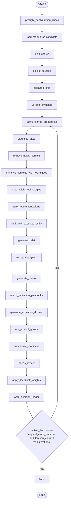

# Sistema Multiagente com LangGraph

## Objetivo

O sistema multiagente implementa a pipeline principal do produto como um grafo LangGraph determinístico, auditável e recuperável. O grafo coordena coleta, extração, scoring, RAG, recomendações, qualidade e revisão humana sem criar caminhos paralelos de produção.

## Entrada de produção

```text
POST /workflows/product-runs
```

Contratos:

```text
startup_id XOR discovery_candidate_id deve identificar a entidade de entrada
use_rag=false não é caminho válido em produção
APP_MODE=product exige checkpointer persistente PostgreSQL
ProductReadinessService deve estar ready antes de rotas críticas
```

## Implementação

| Elemento | Arquivo |
|---|---|
| Grafo | `src/orchestration/graph.py` |
| Runner | `src/orchestration/runner.py` |
| Estado | `src/orchestration/state.py` |
| Registro de nós | `src/orchestration/nodes.py` |
| Implementação dos nós | `src/orchestration/node_impl.py` |
| Persistência do workflow | `src/repositories/workflow.py` |
| Rotas | `src/api/workflow_routes.py` |

## Grafo principal



## Ordem real da pipeline

A ordem é definida explicitamente em `PIPELINE_ORDER`, não depende da ordem de decorators:

```text
load_startup_or_candidate
plan_search
collect_sources
extract_profile
validate_evidence
score_startup_probabilistic
diagnose_gaps
retrieve_nvidia_context
enhance_contexts_with_techniques
map_nvidia_technologies
rank_recommendations
rank_with_expected_utility
generate_brief
run_quality_gates
generate_claims
match_activation_playbooks
generate_activation_dossier
run_product_quality
summarize_readiness
needs_review
apply_feedback_weights
write_decision_ledger
```

## Estado compartilhado

`ProductWorkflowState` é um schema Pydantic serializável. Ele é usado tanto no grafo quanto no snapshot do banco.

| Grupo | Campos principais |
|---|---|
| Identidade | `workflow_id`, `startup_id`, `discovery_candidate_id`, `analysis_run_id` |
| Status | `status`, `current_node`, `completed_nodes`, `failed_nodes`, `degraded_nodes`, `blockers` |
| Coleta | `search_plan`, `raw_evidence`, `evidence_items`, `evidence_ids` |
| Perfil | `startup_profile`, `classification_result` |
| Scores | `scores`, `evidence_weighted_scores`, `score_ids` |
| Gaps | `gap_ids`, `nvidia_contexts`, `technique_results` |
| Recomendações | `nvidia_mappings`, `mapping_ids`, `recommendations`, `ranked_recommendations` |
| Produto | `brief`, `claim_ids`, `dossier_id`, `quality_run_id`, `readiness_check_ids` |
| Revisão | `review_payload`, `review_required`, `review_decision`, `feedback_counts`, `adjusted_weights` |
| Auditoria | `node_outputs`, `decision_ledger_path`, `metadata_json`, `error_message` |

## Nós e responsabilidades

| Nó | Responsabilidade | Crítico |
|---|---:|---:|
| `preflight_configuration_check` | validar readiness e configs YAML | sim |
| `load_startup_or_candidate` | carregar startup ou promover candidate | sim |
| `plan_search` | criar plano de fontes/consultas | sim |
| `collect_sources` | coletar evidências governadas | sim |
| `extract_profile` | extrair perfil estruturado | sim |
| `validate_evidence` | validar qualidade e cobertura | sim |
| `score_startup_probabilistic` | classificar AI-native e calcular score | sim |
| `diagnose_gaps` | identificar gaps técnicos | sim |
| `retrieve_nvidia_context` | recuperar contexto NVIDIA obrigatório | sim |
| `enhance_contexts_with_techniques` | aplicar técnicas híbridas RAG | sim |
| `map_nvidia_technologies` | mapear gaps para tecnologias | sim |
| `rank_recommendations` | gerar ranking preliminar | sim |
| `rank_with_expected_utility` | ordenar por utilidade esperada | sim |
| `generate_brief` | criar action brief | sim |
| `run_quality_gates` | validar qualidade mínima da saída | sim |
| `generate_claims` | gerar claims vinculados a evidência | sim |
| `match_activation_playbooks` | mapear playbooks de ativação | sim |
| `generate_activation_dossier` | criar dossier persistido | sim |
| `run_product_quality` | executar avaliação agregada do produto | sim |
| `summarize_readiness` | consolidar readiness final | sim |
| `needs_review` | interromper para revisão se necessário | não |
| `apply_feedback_weights` | ajustar pesos por feedback humano | não |
| `write_decision_ledger` | gravar trilha de decisão | sim |

## Semântica de status

```text
PENDING   nó criado, não executado
RUNNING   nó em execução
COMPLETED nó completou com output válido
SKIPPED   nó pulado; bloqueante se crítico em produto
DEGRADED  nó retornou saída parcial; bloqueante se crítico em produto
FAILED    nó falhou; sempre bloqueante
```

Workflow:

```text
queued → running → awaiting_review | completed | failed | degraded | cancelled
```

## Retry e erro

O wrapper `_make_langgraph_node()` faz retry de exceções e de status degradado em nós críticos quando `APP_MODE=product`.

Variável:

```text
WORKFLOW_NODE_MAX_RETRIES=2
```

Regras:

```text
mínimo 0
máximo 5
LangGraph interrupts não são capturados como falha
cada retry incrementa WorkflowNodeRun.retry_count
falha final levanta NodeExecutionError e marca workflow failed
```

## Checkpoint e interrupção humana

O runner escolhe checkpointer nesta ordem:

1. `PostgresSaver` se `PRODUCT_DB_URL`/Postgres estiver disponível.
2. `MemorySaver` apenas fora de `APP_MODE=product`.

Em produto, se o checkpointer não for Postgres, o workflow falha com erro explícito.

Quando `needs_review` interrompe o grafo:

```text
workflow_runs.status = awaiting_review
workflow_runs.current_node = needs_review
workflow_runs.state_json.review_required = true
workflow_runs.state_json.review_payload = payload de revisão
metadata_json._langgraph_thread_id = thread_id
```

Retomada:

```text
POST /workflows/{workflow_id}/resume
```

A retomada persiste `ReviewDecision`, envia `Command(resume=...)` para LangGraph e continua a partir do checkpoint.

## Persistência por nó

Cada nó grava:

```text
input_snapshot_json
output_snapshot_json
status
error_message
retry_count
started_at
completed_at
```

Esses snapshots são a base para auditoria, debugging e explicação da decisão final.

## Contratos de produção

A pipeline só deve ser aceita quando:

```text
preflight passa sem blockers
RAG retorna contexts citation-ready
recommendations e ranked_recommendations não estão vazios
quality gates não possuem blockers críticos
claims críticos não ficam unsupported
product quality run é persistido
decision ledger é escrito
workflow termina em completed ou awaiting_review com payload válido
```

## Testes úteis

```bash
pytest -q tests/unit/test_workflow_state.py
pytest -q tests/unit/test_workflow_repository.py
pytest -q tests/unit/test_workflow_runner.py
pytest -q tests/integration/test_product_workflow_api.py
python scripts/check_single_runtime_pipeline.py
```
