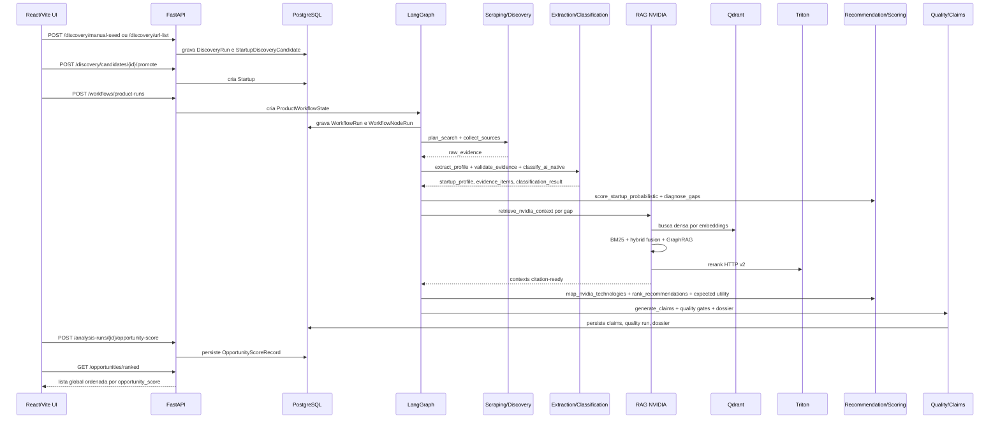

# Tecnologias e Técnicas Usadas no Projeto

## Objetivo

Este documento explica não apenas **quais tecnologias** existem no NVIDIA Startup AI Radar, mas **como cada tecnologia/técnica é usada no runtime real do produto**.

O sistema combina engenharia de backend, orquestração multiagente, scraping governado, RAG híbrido, GraphRAG, reranking por NVIDIA Triton, scoring probabilístico, validação de evidências e ranking por utilidade esperada. O resultado final esperado é uma lista ranqueada de startups/oportunidades, acessível por `GET /opportunities/ranked`.

## Mapa rápido: tecnologia → onde → como

| Tecnologia/técnica | Onde está | Como é usada no produto |
|---|---|---|
| FastAPI | `src/api/main.py`, `src/api/product_routes.py`, `src/api/workflow_routes.py` | Expõe a API REST do produto. Recebe startups/candidatos, dispara workflows, expõe health/readiness, claims, dossiers, quality runs e ranking global. |
| Pydantic v2 | `src/api/product_schemas.py`, `src/orchestration/state.py`, `src/extraction/schemas.py` | Define contratos tipados de entrada/saída, valida estado do workflow, perfis extraídos, evidências, recomendações e respostas da API. |
| SQLAlchemy | `src/database/models.py`, `src/repositories/` | Mapeia entidades de produto para tabelas relacionais e centraliza leitura/escrita transacional via repositórios. |
| Alembic | `migrations/` | Versiona o schema do banco e cria tabelas como startups, analysis runs, workflow runs, claims, dossiers, quality runs e opportunity scores. |
| PostgreSQL | `PRODUCT_DB_URL` | Banco transacional principal. Persiste todo o histórico auditável do produto. |
| LangGraph | `src/orchestration/graph.py`, `src/orchestration/runner.py` | Orquestra a pipeline única de produção como um grafo de nós determinísticos com estado compartilhado, retry, checkpoint e interrupção humana. |
| LangGraph PostgresSaver | `src/orchestration/runner.py` | Persiste checkpoints do grafo em produção para retomada e human-in-the-loop. |
| React + TypeScript + Vite | `frontend/` | Interface de produto. Consome a API para discovery, workflows, ranking, detalhes, revisão humana, dossier e quality summary. |
| Qdrant | `src/rag/qdrant_store.py`, `.env.example` | Vector store do corpus NVIDIA. Guarda embeddings de chunks técnicos e faz busca semântica por similaridade. |
| BAAI/bge-m3 | `RAG_EMBEDDING_MODEL=BAAI/bge-m3` | Modelo de embedding usado para converter chunks e queries em vetores de 1024 dimensões antes da busca no Qdrant. |
| BM25 / Okapi | `src/rag/sparse_retrieval.py`, `config/rag_retrieval.yaml` | Busca lexical no corpus local. Complementa a busca vetorial quando a query contém termos técnicos exatos como CUDA, NIM, Triton ou RAPIDS. |
| Retrieval híbrido | `src/rag/hybrid_retrieval.py`, `src/rag/rag_service_factory.py` | Combina resultados lexicais e semânticos, aplica fusão/ranking e entrega candidatos para reranking. |
| GraphRAG | `src/rag/graphrag_runtime.py` | Expande contextos por relações entre entidades, produto NVIDIA, fonte, gap técnico e lineage path. Reduz recomendações sem evidência relacional. |
| NVIDIA Triton reranker | `src/rag/triton_reranker.py` | Reordena contextos via endpoint HTTP v2 `/infer`, usando pares `[query, contexto]` e scores prévios. Em produto é obrigatório. |
| Technique runner | `src/rag/technique_runner.py`, `config/techniques.yaml` | Executa grupos de técnicas RAG em ordem dependente: retrieval, reranking, post-processing e reflection. Registra sucesso, latência, delta de qualidade e erros. |
| AI-native classifier | `src/classification/ai_native_classifier.py`, `src/classification/ai_native_model.py` | Classifica a startup como non-ai, ai-assisted, ai-enabled, ai-native ou ai-native-service usando sinais heurísticos e, se existir, modelo local Naive Bayes por tokens. |
| Gap diagnosis | `src/diagnosis/gap_diagnosis.py` | Detecta gaps técnicos como inferência, latência, governança de agentes, observabilidade, avaliação, privacidade, dados, visão, voz, robótica, healthcare e cybersecurity. |
| Evidence-weighted scoring | `src/decisioning/evidence_weighted_scorer.py` | Calcula scores ponderados por qualidade de evidência, cobertura, diversidade de fontes e variância. Retorna score, confiança e incerteza. |
| Expected utility ranking | `src/decisioning/expected_utility_ranker.py` | Reordena recomendações por valor esperado, confiança, evidência, risco, complexidade e incerteza. |
| Opportunity score | `src/services/product/opportunity_score_service.py` | Calcula o score final da startup/análise e persiste `OpportunityScoreRecord`, usado pelo ranking global. |
| Claim ledger | `src/services/product/claim_ledger.py` | Registra claims auditáveis com suporte de evidência, nível de suporte e status de revisão. |
| Quality gates | `src/quality/` | Valida cobertura de evidência, claims sem suporte, completude do dossier, actionability, readiness, export readiness e confiabilidade de outputs estruturados. |
| Prometheus metrics | `src/observability/metrics.py`, `/metrics` | Expõe métricas operacionais quando `prometheus_client` está instalado, incluindo latência/status por nó. |
| Playwright | `frontend/playwright.config.ts` | Testes E2E da interface de produto. |
| Pytest | `tests/`, `pyproject.toml` | Testes unitários, integração, aceitação, RAG, backend e validação de produto. |
| Ruff, Black, Mypy | `pyproject.toml` | Qualidade estática: lint, formatação e checagem de tipos. |
| Bandit, pip-audit, detect-secrets | `pyproject.toml`, `scripts/` | Segurança: SAST, auditoria de dependências e detecção de segredos. |

## Como as tecnologias se conectam no fluxo real



## Backend e API

### FastAPI

FastAPI é a borda HTTP do produto. O app é criado em `src/api/main.py`, com routers separados para produto e workflow:

```text
src/api/product_routes.py
src/api/workflow_routes.py
```

Como é usado:

1. Recebe payloads de criação/importação de startups.
2. Valida requests por schemas Pydantic.
3. Usa `Depends(get_db_session)` para abrir sessão SQLAlchemy.
4. Aplica `ReadinessGate()` em rotas mutáveis críticas.
5. Chama serviços de domínio, por exemplo `WorkflowOrchestrationService`, `ProductService`, `OpportunityScoreService`, `ProductQualityService`.
6. Retorna DTOs tipados para a UI.

Endpoints críticos:

```text
POST /workflows/product-runs
GET  /workflows/product-runs/{workflow_id}/nodes
POST /analysis-runs/{analysis_run_id}/opportunity-score
GET  /opportunities/ranked
GET  /product/readiness
GET  /health/dependencies
```

### Pydantic

Pydantic é usado como contrato de fronteira e de estado interno.

Principais usos:

| Uso | Exemplo | Como ajuda |
|---|---|---|
| API schemas | `src/api/product_schemas.py` | Garante que request/response seguem formato previsível. |
| Estado do grafo | `ProductWorkflowState` | Mantém o estado serializável entre nós LangGraph. |
| Extração | `StartupProfile`, `Evidence` | Normaliza evidências e perfil extraído. |
| Dossier/claims | schemas de serviços | Impede outputs incompletos ou fora de formato. |

## Persistência e banco

### PostgreSQL + SQLAlchemy

PostgreSQL é o sistema de registro do produto. SQLAlchemy define os modelos e os repositórios encapsulam operações de escrita/leitura.

Como é usado:

1. `StartupDiscoveryCandidate` armazena candidatos descobertos.
2. `Startup` representa entidades promovidas para análise.
3. `AnalysisRun` representa uma execução de análise.
4. `WorkflowRun` e `WorkflowNodeRun` registram estado e auditoria por nó.
5. `ScoreRecord`, `GapDiagnosisRecord`, `NvidiaMappingRecord` e `ClaimRecord` guardam resultados intermediários auditáveis.
6. `ActivationDossierRecord`, `ProductQualityRun` e `OpportunityScoreRecord` guardam a saída final de produto.

Relação de alto nível:

```text
Startup
  └── AnalysisRun
        ├── ScoreRecord
        ├── GapDiagnosisRecord
        ├── NvidiaMappingRecord
        ├── ClaimRecord
        ├── ActivationRecommendationRecord
        ├── ActivationDossierRecord
        ├── ProductQualityRun
        └── OpportunityScoreRecord
```

### Alembic

Alembic versiona o schema. O setup esperado é:

```bash
alembic upgrade head
```

Sem migrations aplicadas, o produto não deve ser considerado pronto.

## Orquestração multiagente com LangGraph

LangGraph é usado para modelar a pipeline de produto como um grafo de estado. O grafo é construído em `build_workflow_graph()`.

A pipeline real é linear com uma borda condicional após feedback humano:

```text
preflight_configuration_check
→ load_startup_or_candidate
→ plan_search
→ collect_sources
→ extract_profile
→ validate_evidence
→ score_startup_probabilistic
→ diagnose_gaps
→ retrieve_nvidia_context
→ enhance_contexts_with_techniques
→ map_nvidia_technologies
→ rank_recommendations
→ rank_with_expected_utility
→ generate_brief
→ run_quality_gates
→ generate_claims
→ match_activation_playbooks
→ generate_activation_dossier
→ run_product_quality
→ summarize_readiness
→ needs_review
→ apply_feedback_weights
→ write_decision_ledger
→ finish
```

Como é usado:

1. Cada nó recebe um `ProductWorkflowState`.
2. Cada nó retorna `NodeResult` com status e `state_updates`.
3. O wrapper do grafo registra input/output do nó em `workflow_node_runs`.
4. Em `APP_MODE=product`, nós críticos falham fechado se retornarem `FAILED`, `DEGRADED` ou `SKIPPED`.
5. `WORKFLOW_NODE_MAX_RETRIES` controla retries por nó.
6. `PostgresSaver` persiste checkpoints para retomada.
7. `needs_review` pode pausar o fluxo para revisão humana.

## Discovery e scraping governado

### Técnicas de descoberta

O discovery aceita três tipos de entrada:

| Entrada | Endpoint | Como funciona |
|---|---|---|
| Manual seed | `POST /discovery/manual-seed` | Recebe startups estruturadas e cria candidatos. |
| URL list | `POST /discovery/url-list` | Recebe URLs e extrai candidatos a partir do conteúdo. |
| Source scraper | `POST /discovery/run-source-scraper` | Usa fontes cadastradas em `src/config/discovery_sources.json`. |

### Técnicas de scraping/coleta

As dependências de scraping e parsing incluem `httpx`, `requests`, `beautifulsoup4`, `trafilatura`, `playwright`, `crawl4ai`, `selectolax`, `readability-lxml`, `feedparser`, `pymupdf`, `markitdown`, `youtube-transcript-api`, `rapidfuzz`, `diskcache`, `tenacity`, `tldextract`, `langdetect`, `orjson` e `praw`.

Como entram no produto:

| Técnica | Como é usada |
|---|---|
| HTTP clients (`httpx`, `requests`) | Baixam páginas e APIs públicas quando permitido. |
| HTML extraction (`BeautifulSoup`, `selectolax`, `readability-lxml`, `trafilatura`) | Extraem texto principal e reduzem boilerplate. |
| Browser automation (`Playwright`) | Suporte a páginas dinâmicas quando necessário. |
| Crawl4AI | Coleta estruturada opcional quando configurada. |
| Feed parsing (`feedparser`) | Coleta conteúdo de feeds quando fonte usa RSS/Atom. |
| PDF/Docs (`pymupdf`, `markitdown`) | Converte documentos em texto rastreável. |
| YouTube transcript | Captura transcrições quando fonte pública usa vídeos. |
| `rapidfuzz` | Deduplicação fuzzy por nome/domínio/texto. |
| `diskcache` | Cache local de coleta. |
| `tenacity` | Retry controlado. |
| `tldextract` | Normalização de domínio. |
| `langdetect` | Sinal de idioma. |
| `praw` | Coleta opcional de Reddit quando configurada. |

Políticas técnicas:

```text
robots/terms awareness
rate limit por domínio
cache / ETag / Last-Modified quando aplicável
retry e circuit breaker
deduplicação fuzzy
source quality prior
min_raw_evidence
min_distinct_sources
min_source_categories
min_official_sources
max_error_rate
```

## Extração, classificação e diagnóstico

### Extração estruturada

`src/extraction/extractor.py` transforma texto coletado em `StartupProfile`.

Como funciona:

1. Junta conteúdo relevante por startup/candidato.
2. Extrai nome, setor, descrição e resumo do produto.
3. Detecta sinais de IA, stack técnica, financiamento, produto e mercado.
4. Calcula `confidence_score` com base em evidência e quantidade/qualidade dos sinais.
5. Cria objetos `Evidence` com claim, fonte, tipo e confiança.

### Classificação AI-native

A classificação tem duas camadas:

1. **Heurística determinística:** padrões como `llm`, `large language model`, `computer vision`, `predictive model`, `generative ai`, `fine-tuned`, `workflow integration` etc.
2. **Modelo local opcional:** `models/ai_native_classifier/model.json`, um classificador Naive Bayes por tokens treinável via JSONL. Se o modelo não existir ou falhar, o sistema usa o prior heurístico.

Classes possíveis:

```text
non_ai
ai_assisted
ai_enabled
ai_native
ai_native_service
```

A saída inclui:

```text
classification
confidence
reasoning
evidence_used
missing_evidence
probabilities
uncertainty
model_version
model_available
classification_features
```

### Diagnóstico de gaps

`src/diagnosis/gap_diagnosis.py` detecta problemas técnicos que podem ser resolvidos por tecnologias NVIDIA.

Exemplos de gaps:

```text
external_api_dependency
inference_cost
latency
agent_governance
observability
model_evaluation
privacy_deployment
data_pipeline
tabular_processing
voice_need
simulation_need
computer_vision_need
robotics_need
healthcare_compliance
cybersecurity_need
```

Como é usado:

1. O diagnóstico combina texto do perfil, evidências aceitas e sinais de classificação.
2. Cada gap gera confiança, justificativa, evidências associadas e missing evidence.
3. Apenas gaps aceitos seguem para RAG e mapeamento NVIDIA.

## RAG NVIDIA: técnicas e como funcionam

O modo oficial é:

```text
bm25_graphrag_qdrant_triton_rerank
```

### Chunking e corpus

O corpus técnico NVIDIA fica em:

```text
data/nvidia_corpus/
data/nvidia_corpus/sources.yaml
```

A ingestão cria chunks com metadados de fonte, produto, URL, versionamento e freshness. Esses chunks alimentam dois índices:

1. **Índice lexical local** usado por BM25.
2. **Coleção Qdrant** usada por busca vetorial.

### Embeddings com BAAI/bge-m3

`BAAI/bge-m3` é usado para gerar embeddings de 1024 dimensões.

Como é usado:

1. Durante ingestão, cada chunk vira um vetor.
2. Durante retrieval, cada query gerada a partir de um gap vira vetor.
3. Qdrant calcula similaridade entre query e chunks.

### BM25 lexical retrieval

BM25 encontra chunks por sobreposição lexical ponderada. É útil para termos exatos:

```text
CUDA
NVIDIA NIM
Triton Inference Server
TensorRT-LLM
RAPIDS
cuDF
Morpheus
NeMo Guardrails
```

Configuração:

```yaml
BM25_TOP_K=20
BM25_K1=1.5
BM25_B=0.75
```

Como é usado:

1. A query do gap é tokenizada.
2. O índice local calcula score BM25 por chunk.
3. Os melhores chunks entram no conjunto candidato híbrido.

### Dense retrieval com Qdrant

Qdrant busca chunks semanticamente próximos, mesmo quando não há match lexical exato.

Como é usado:

1. A query do gap é embeddada.
2. Qdrant retorna os top-k chunks por similaridade vetorial.
3. Os resultados densos são combinados com BM25.

### Fusão híbrida

A fusão combina sinais lexicais e semânticos para reduzir fragilidade:

```text
BM25 cobre termos exatos.
Qdrant cobre semântica.
GraphRAG cobre relações.
Triton reordena por aderência query-contexto.
```

A configuração oficial declara pesos:

```yaml
dense_weight: 0.40
bm25_weight: 0.35
graphrag_weight: 0.25
rrf_k: 60
```

### Reranking local

Antes do Triton, o projeto aplica reranking local/proveniência para valorizar:

```text
match com gap
match com tecnologia NVIDIA
qualidade de fonte
recência/freshness
remoção de duplicados
```

### GraphRAG

GraphRAG cria expansão relacional a partir de contextos já recuperados.

Como funciona em `src/rag/graphrag_runtime.py`:

1. Recebe contextos seed.
2. Extrai entidades técnicas do título, produto e conteúdo.
3. Compara novos chunks por entidades compartilhadas, produto NVIDIA, `source_id` e `gap_type`.
4. Atribui score relacional.
5. Retorna vizinhos de grafo com lineage summary.

O objetivo é encontrar contexto técnico que talvez não tenha sido top-1 lexical ou vetorial, mas está conectado por produto, fonte ou gap.

### NVIDIA Triton reranker

Triton é a etapa final de reranking em produção.

Como é usado:

1. O serviço monta `text_pairs = [[query_text, context.content], ...]`.
2. Envia payload HTTP v2 para `TRITON_RERANKER_URL`.
3. Recebe `scores` ou `outputs[0].data`.
4. Reatribui `relevance_score` a cada contexto.
5. Ordena por score descendente.
6. Em `APP_MODE=product`, falha de URL ou chamada bloqueia o workflow.

Payload esperado:

```json
{
  "inputs": [
    {"name": "text_pairs", "shape": [N, 2], "datatype": "BYTES", "data": [["query", "context"]]},
    {"name": "scores", "shape": [N], "datatype": "FP32", "data": [0.74]}
  ],
  "parameters": {"query": "..."}
}
```

### Context filtering e citation-ready

Após reranking:

1. Contextos abaixo de `rag.context_relevance_threshold` são removidos.
2. Duplicatas por `chunk_id` são descartadas.
3. Contexto só é considerado citation-ready se tiver `source_id` e `url`.
4. Métricas como `citation_ready_context_count`, `average_relevance_score` e `context_count_by_gap` são registradas.

## Technique runner: técnicas adicionais

O nó `enhance_contexts_with_techniques` roda depois do RAG oficial. Ele lê `config/techniques.yaml` e executa grupos em ordem de dependência.

Grupos:

| Grupo | Técnicas configuradas | Como são usadas |
|---|---|---|
| `retrieval` | `adaptive_rag`, `hyde`, `multi_query`, `fusion_retrieval`, `bm25`, `graphrag_runtime`, `query_intent` | Expande/refina contextos e consulta, mantendo rastreabilidade. |
| `reranking` | `colbert_reranking`, `cross_encoder`, `listwise_reranking`, `llm_reranking`, `neural_reranking`, `pointwise_reranking`, `triton_reranker` | Reordena ou ajusta relevância dos contextos. |
| `post_processing` | `self_rag`, `source_trust`, `factual_consistency`, `hallucination_detection`, `contradiction_detection`, `uncertainty_estimation`, `confidence_calibration`, `contextual_compression`, `semantic_chunking` | Filtra, comprime e calibra contextos antes de recomendação. |
| `reflection` | `multi_hop_graph`, `structured_outputs`, `graph_consistency`, `truth_maintenance`, `case_based_reasoning` | Checa consistência e estruturação final dos contextos enriquecidos. |

Observação importante: o catálogo em `src/rag/` é amplo, mas o caminho de produção é governado por `config/techniques.yaml`. Técnicas fora da configuração não devem ser consideradas ativas no produto final.

Cada execução registra:

```text
technique
group
success
input_count
output_count
latency_ms
quality_delta
cost_estimate
error
evidence.free_self_hosted
evidence.runtime_mode
```

## Mapeamento NVIDIA e recomendação

### Gap-to-technology mapping

`src/recommendation/nvidia_technology_mapping.py` converte gaps técnicos em tecnologias NVIDIA recomendáveis.

Como é usado:

1. Recebe gaps diagnosticados.
2. Verifica contextos RAG por tecnologia.
3. Calcula features de aderência: match de gap, suporte de contexto, evidência, confiança, bloqueadores e maturidade.
4. Gera `NvidiaMappingRecord` com tecnologia, justificativa, ação e prioridade.

Tecnologias NVIDIA cobertas na documentação/corpus incluem, entre outras:

```text
NVIDIA NIM
Triton Inference Server
TensorRT-LLM
CUDA
RAPIDS
cuDF
cuML
NeMo
NeMo Guardrails
Morpheus
Riva
Isaac
Omniverse
MONAI / Clara
NVIDIA AI Enterprise
NVIDIA Inception
```

### Ranking inicial

`rank_recommendations` ordena recomendações por prioridade técnica e suporte.

Critérios usados:

```text
confidence
business_impact
implementation_complexity_inverse
rag_support
evidence_support
```

### Expected utility

`rank_with_expected_utility` usa a fórmula implementada em `expected_utility_ranker.py`:

```text
utility = clamp(
  expected_value * confidence * (1 - uncertainty) * (0.5 + 0.5 * evidence_support)
  - mean(implementation_complexity, risk)
)
```

Interpretação:

| Variável | Efeito |
|---|---|
| `expected_value` | Aumenta utilidade quando o impacto potencial é maior. |
| `confidence` | Penaliza recomendações pouco confiáveis. |
| `uncertainty` | Reduz utilidade quando há incerteza alta. |
| `evidence_support` | Multiplica o valor quando há suporte de evidência/RAG. |
| `implementation_complexity` | Reduz utilidade se for difícil implementar. |
| `risk` | Reduz utilidade se houver risco técnico/operacional. |

## Opportunity score e ranking global

`OpportunityScoreService` calcula o score final usado em `GET /opportunities/ranked`.

Componentes e pesos:

| Componente | Peso |
|---|---:|
| `composite_ranking` | 0.20 |
| `evidence_coverage` | 0.15 |
| `gap_resolution` | 0.12 |
| `nvidia_mapping` | 0.10 |
| `activation_readiness` | 0.10 |
| `dossier_completeness` | 0.10 |
| `quality_score` | 0.08 |
| `claim_support` | 0.07 |
| `review_status` | 0.05 |
| `production_readiness` | 0.03 |

Como é calculado:

1. Coleta componentes disponíveis da análise.
2. Redistribui pesos entre componentes presentes.
3. Calcula `base_score` ponderado.
4. Aplica penalidades por claims sem suporte, baixa cobertura, estados degradados, contraindicações, non-AI, baixa confiança e dados incompletos.
5. Clampa o resultado entre 0 e 1.
6. Define tier:

```text
critical: score >= 0.85
high:     score >= 0.70
medium:   score >= 0.50
low:      score >= 0.30
not_recommended: abaixo de 0.30 ou contraindicação
```

7. Persiste `OpportunityScoreRecord`.
8. `GET /opportunities/ranked` ordena por `opportunity_score` descendente.

## Validação, qualidade e segurança

### Quality gates

`src/quality/service.py` roda avaliadores como:

```text
EvidenceCoverageEvaluator
DossierCompletenessEvaluator
ActivationPlaybookEvaluator
RecommendationActionabilityEvaluator
DegradedStateEvaluator
ExportReadinessEvaluator
ReviewReadinessEvaluator
StructuredOutputReliabilityEvaluator
```

Eles medem:

```text
evidence_coverage
unsupported_claim_rate
unsupported_critical_claim_count
weak_claim_rate
dossier_section_completeness
activation_playbook_present
activation_playbook_evidence_support
recommendation_actionability_score
degraded_state_count
export_readiness_score
review_readiness_score
structured_output_valid_rate
structured_output_failure_rate
```

### Claim ledger

O claim ledger transforma frases de recomendação/briefing em claims rastreáveis:

```text
claim text
claim type
evidence refs
support level
confidence
review status
```

Claims críticos sem suporte reduzem score e podem exigir revisão.

### Segurança e compliance técnico

Ferramentas configuradas:

| Ferramenta | Uso |
|---|---|
| `detect-secrets` | Evita segredos hardcoded. |
| `pip-audit` | Audita CVEs em dependências Python. |
| `bandit` | SAST para Python. |
| `OpenSSF Scorecard` | Verificação de boas práticas de supply chain. |
| `ruff`, `black`, `mypy` | Qualidade estática. |

## Como verificar que as técnicas estão realmente ativas

Use estes comandos:

```bash
python scripts/check_single_runtime_pipeline.py
python scripts/check_product_configuration.py --actual-env-only
python scripts/check_docs_match_runtime.py
python scripts/check_rag_corpus_coverage.py
python scripts/check_reranker_ready.py
python scripts/product_doctor.py
```

Testes úteis:

```bash
pytest -q tests/unit/test_hybrid_rag.py
pytest -q tests/unit/test_rag_reranking.py
pytest -q tests/unit/test_qdrant_rag_service.py
pytest -q tests/unit/test_graphrag_evidence_graph_product_spike.py
pytest -q tests/unit/test_opportunity_score_service.py
```

Critérios mínimos:

1. `RAG_RETRIEVAL_MODE=bm25_graphrag_qdrant_triton_rerank`.
2. `BM25_ENABLED=true`.
3. `GRAPHRAG_ENABLED=true`.
4. `TRITON_RERANKER_REQUIRED=true`.
5. Qdrant possui coleção `nvidia_corpus` ingestado.
6. `POST /workflows/product-runs` executa a pipeline única.
7. `GET /opportunities/ranked` retorna ranking real persistido, não mockado.
8. Cada recomendação relevante tem evidência ou contexto RAG citation-ready.
